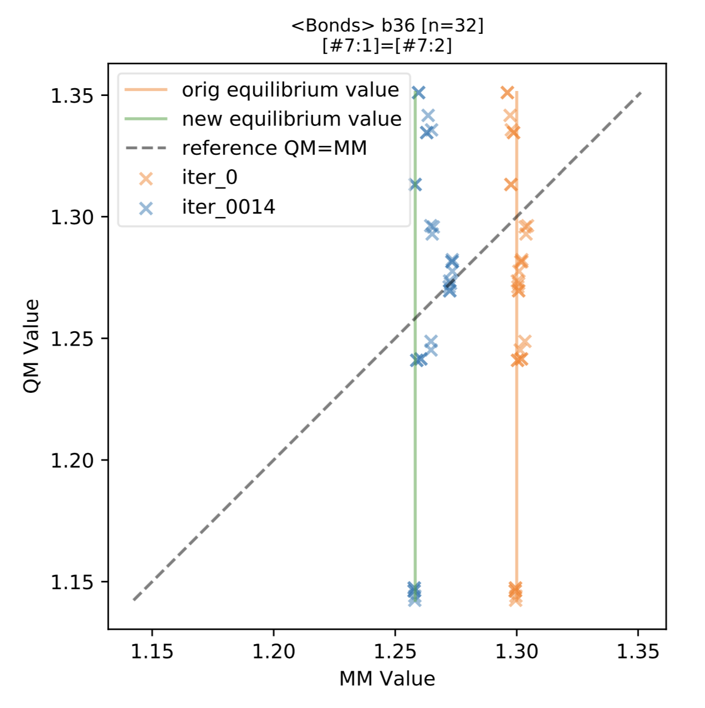
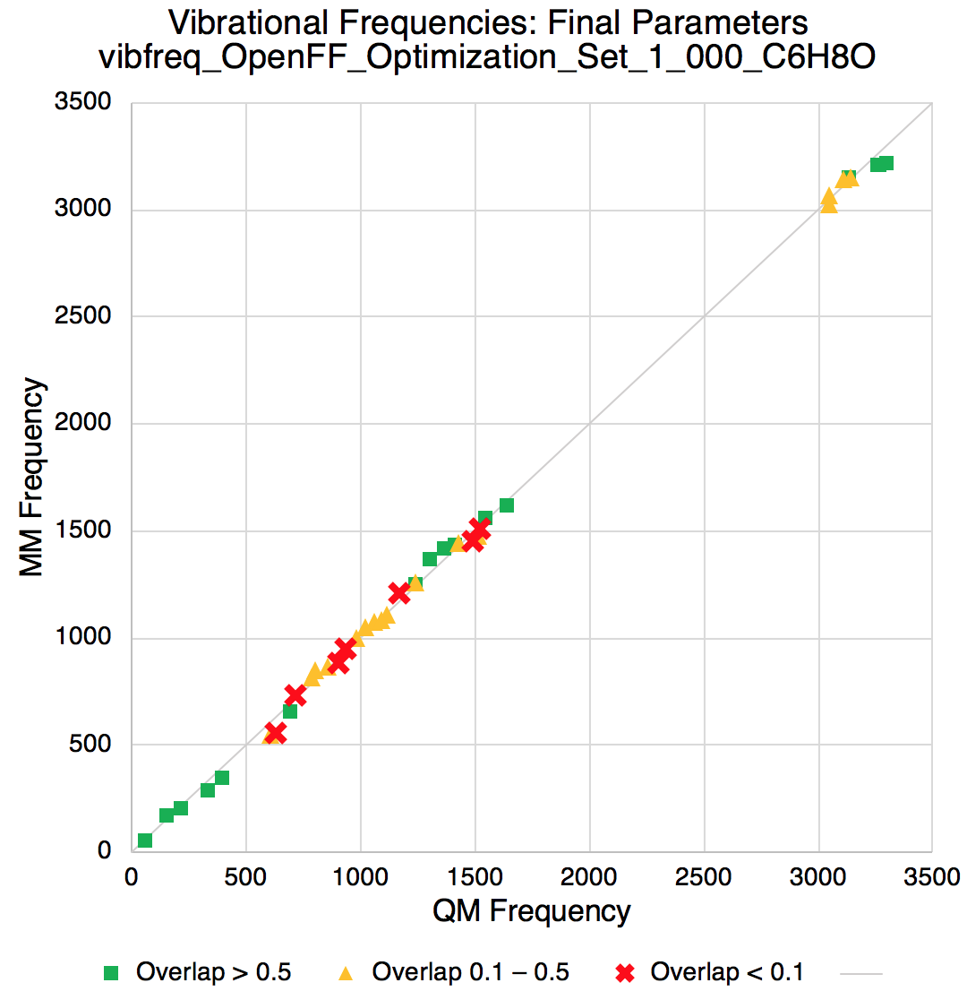
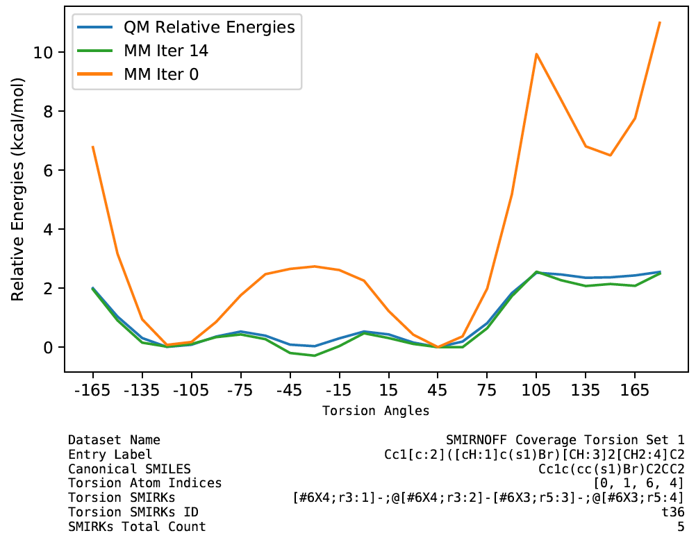
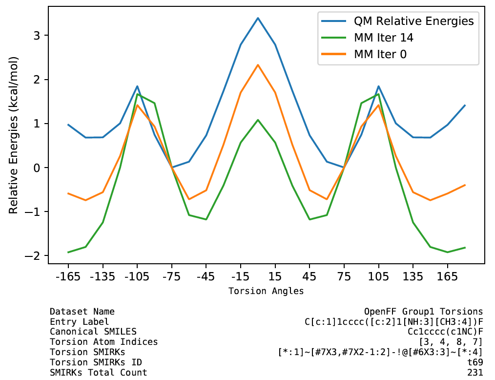
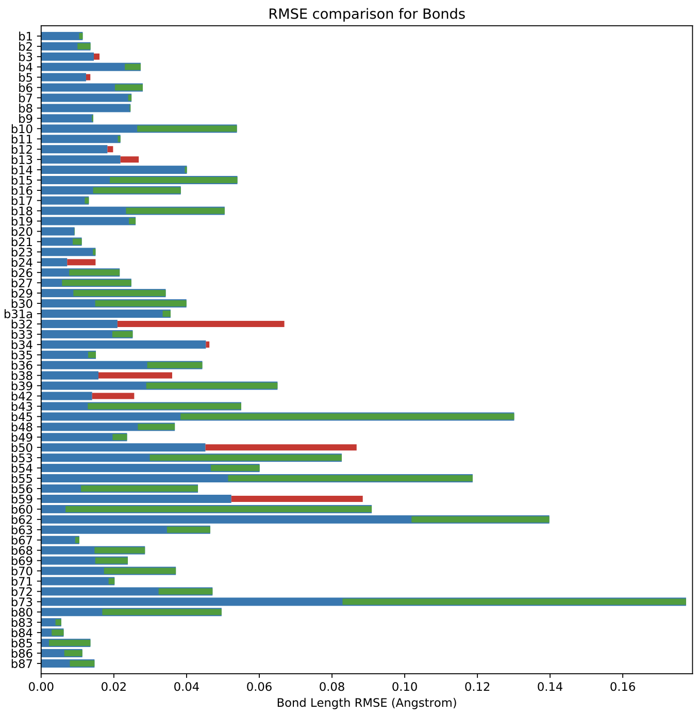

<!-- Parsley CC0 image from https://www.maxpixel.net/Leaf-Plant-Parsley-Common-Aromatic-Parsley-Leaves-3327372 -->
<center>

</center>

We’re delighted to announce the release of "Parsley", the [Open Force Field 1.0 small molecule force field](https://github.com/openforcefield/openforcefields/releases/tag/1.0.0)---the first in a series of iteratively-improved small molecule force fields for biomolecular simulation funded in part by the [Open Force Field Consortium](http://openforcefield.org/consortium).
This is the first optimized force field to use the [SMIRNOFF force field specification](https://open-forcefield-toolkit.readthedocs.io/en/latest/smirnoff.html) for atom type-free [direct chemical perception](https://dx.doi.org/10.1021/acs.jctc.8b00640), and provides substantially improved valence (bond, angle, and torsion) parameters relative to its predecessor, the AMBER-lineage [SMIRNOFF99Frosst](https://dx.doi.org/10.1021/acs.jctc.8b00640).
This force field was optimized to improve agreement with quantum chemical geometries, energetics, and vibrational frequencies, and will likely provide improved accuracy (relative to its predecessor) for a wide variety of properties, especially energetics and geometries relative to gas phase quantum chemical calculations

In this release, we retained the typing/chemical perception tree from [SMIRNOFF99Frosst 1.1.0](https://github.com/openforcefield/smirnoff99Frosst/releases/tag/1.1.0), but optimized nearly all (481/500) valence parameters, retaining the toolkit-based [AM1-BCC](https://doi.org/10.1002/jcc.10128) charge model and Lennard-Jones parameters of its predecessor.
[SMIRNOFF99Frosst](https://github.com/openforcefield/smirnoff99Frosst) was a manually-curated direct descendent of the older [parm@Frosst](http://www.ccl.net/cca/data/parm_at_Frosst/) small molecule force field, adapted for the SMIRNOFF specification without parameter refitting.
By optimizing the vast majority of parameters, we have produced a substantially new force field which is better supported by quantum chemical calculations.

Initial benchmarking focused on two major aspects: (1) Accuracy relative to quantum chemical calculations on a test set of molecules, and (2) accuracy on condensed phase properties for a diverse set of molecules.
Quantum chemical benchmarks covered a set of more than 2000 molecules, examining the quality of optimized geometries and relative conformer energies.
Performance improved substantially relative to [SMIRNOFF99Frosst](https://github.com/openforcefield/smirnoff99Frosst).
On condensed-phase properties (density, dielectric constant, heat of vaporization, excess molar volume and enthalpy of mixing), no dramatic performance differences were noted in this release as expected, since valence parameters typically play a relatively minor role in these properties.
Performance on condensed-phase properties was comparable to GAFF.

To enable this improved force field to be of immediate use to the community, we provide a brief overview of the automated fitting procedure, the curation of training and benchmark datasets, and initial benchmarks.
The [Open Force Field Initiative](http://openforcefield.org) aims to provide not only new biomolecular force fields, but also open source  automated parameterization infrastructure, along with versioned, curated datasets to advance biomolecular force field science.
We have released all datasets and open source code for the community to reproduce and build on everything we have done to produce this force field. Complete details will be provided in a forthcoming paper that builds upon the initial overview reported in this blog post.


## Major contributors

Many individuals form the [Open Force Field Initiative](http://openforcefield.org/members) contributed to the construction of data sets, infrastructure, parameterization, and benchmarks for this first force field release. We would like to thank to our entire team for their hard work, our industry partners for their support and helpful feedback, and many others who have joined numerous scientific discussions which  preceded this release.

The following scientists made particularly crucial contributions to the development of Parsley:

* [Yudong Qiu](https://orcid.org/0000-0003-4345-8356) (UC Davis)
* [Daniel G. A. Smith](https://orcid.org/0000-0001-8626-0900) (MolSSI)
* [Simon Boothroyd](https://orcid.org/0000-0002-3456-1872) (MSKCC)
* [Jeffrey Wagner](https://orcid.org/0000-0001-6448-0873) (UC Irvine)
* [Caitlin C. Bannan](https://orcid.org/0000-0003-2777-1174) (UC Irvine)
* [Trevor Gokey](https://orcid.org/0000-0001-7856-1156) (UC Irvine)
* [Hyesu Jang](https://orcid.org/0000-0002-1697-2918) (UC Davis)
* [Victoria T. Lim](https://orcid.org/0000-0003-4030-9312) (UC Irvine)
* [Chaya Stern](https://orcid.org/0000-0001-6200-3993) (MSKCC)
* [Andrea Rizzi](https://orcid.org/0000-0001-7693-2013) (MSKCC)
* [Xavier Lucas](https://orcid.org/0000-0003-0887-3976) (F. Hoffmann-La Roche AG)
* Bryon Tjanaka (UC Irvine)
* [Michael R. Shirts](https://orcid.org/0000-0003-3249-1097) (CU Boulder)
* [Michael K. Gilson](https://orcid.org/0000-0002-3375-1738) (UC San Diego)
* [John D. Chodera](https://orcid.org/0000-0003-0542-119X) (MSKCC)
* [Christopher I. Bayly](https://orcid.org/0000-0001-9145-6457) (OpenEye Scientific Inc.)
* [David L. Mobley](https://orcid.org/0000-0002-1083-5533) (UC Irvine)
* [Lee-Ping Wang](https://orcid.org/0000-0003-3072-9946) (UC Davis)

<br>
## Table of Contents

* <a href="#using-parsley">Using Parsley</a>
* <a href="#citing-parsley">Citing Parsley</a>
* <a href="#fitting-with-forcebalance">Fitting force fields with ForceBalance</a>
* <a href="#fitting-parsley-to-quantum-chemical-data">Fitting Parsley to quantum chemical data</a>
  * <a href="#optimization-datasets">Optimized energies and geometries</a>
  * <a href="#torsion-datasets">Torsion drives</a>
* <a href="#fitting-results">Optimizing parameters in Parsley</a>
* <a href="#benchmarking-parsley">Benchmarking Parsley</a>
  * <a href="#quantum-chemical-benchmarks">Quantum chemical benchmarks</a>
  * <a href="#physical-property-benchmarks">Physical property benchmarks</a>
* <a href="#future-plans">Plans for additional benchmarks</a>

<br>
<a id="using-parsley"></a>
## Using Parsley

The Parsley force field is officially known as `openff-1.0.0.offxml` in our force field package, [`openforcefields`](https://github.com/openforcefield/openforcefields/). Two versions of this file are being released -- One with hydrogen bond length constraints which allow for typical 2 fs timesteps to be taken in simulations (or longer timesteps if suitable algorithms are utilized), and another without the constraints, which is suitable for geometry optimizations and single-point energy calculation.

Using `conda`, users can gain access to the Open Force Field Toolkit and the new force fields by running `conda install -c omnia openforcefield openforcefields`. Once installed, the Open Force Field Toolkit will be able to find and load the new file using the ForceField constructor:

```python
from openforcefield.typing.engines.smirnoff import ForceField
ff = ForceField('openff-1.0.0.offxml')
```
To use  a version of the force field without bond constraints to hydrogens for comparison to quantum chemical geometries:
```python
ff = ForceField('openff_unconstrained-1.0.0.offxml')
```
To see an example of how to use the Parsley force field to run a molecular dynamics simulation, consider downloading and running our [example Jupyter notebooks](https://github.com/openforcefield/openforcefield/tree/master/examples).
Alternatively, the force field files themselves can be found under the `openforcefields/offxml` subdirectory of [the openforcefields GitHub repository](https://github.com/openforcefield/openforcefields)
This specific force field also has a DOI on Zenodo, which can be used when citing it in scholarly work: [](https://doi.org/10.5281/zenodo.3483227)

<br>
<a id="citing-parsley"></a>
## Citing Parsley

We recommend that this force field be referred to as the “Open Force Field v.1.0.0 – Parsley” on first reference, and OpenFF 1.0.0 or “Parsley” thereafter. Bug fix/patch releases in the OpenFF 1.0 series will also be referred to as Parsley, while major versions will receive updated codenames.

To cite Parsley, please cite the DOI for the force field version you use (available in the `openforcefields` [repository](https://github.com/openforcefield/openforcefields/releases)). Our latest force field release DOI is available [here](https://zenodo.org/badge/latestdoi/206618274). The full reference should include a force field DOI and a publication record. The latter refers to our preprint/paper once available, but in the meantime, please use [Zenodo DOI assigned to this blog post](https://doi.org/10.5281/zenodo.3963295) as a source of additional information. You can export citation reference by clicking on a preferred format in the bottom right page corner of the relevant Zenodo record (force field + blog post). We will update this post once a preprint and peer-reviewed publications become available.

<br>
<a id="fitting-force-fields-with-forcebalance"></a>
## Fitting force fields with ForceBalance

We used [ForceBalance](https://doi.org/10.1021/jz500737m) to fit the parameters in Parsley.
Before discussing the data used in fitting and the actual fitting process, we briefly introduce ForceBalance.
[ForceBalance](https://github.com/leeping/forcebalance) is a Python toolkit designed for carrying out force field optimizations in a systematic, reproducible, scalable and flexible way. Here, we employed a development version of ForceBalance based on v1.6.0 (available [here](https://github.com/leeping/forcebalance/tree/5b3a65d1baefe17625c9b05c0db5d27458c5344a)) to fit a SMIRNOFF force field to the optimized geometries, torsional profiles and vibrational frequencies using the objective function as described below.

<a id="regularized-force-field-optimization"></a>
### Regularized force field optimization with quasi-Newton iterations

To determine the parameters for Parsley, we aimed to optimize force field parameters $$\theta$$ to minimize a loss function $$L(\theta)$$ that quantifies deviation from quantum chemical data while adding a regularization penalty to minimize the deviation from a reference set of parameters, following the standard approach for [parameter fitting with ForceBalance](https://doi.org/10.1021/jz500737m):

$$L_\mathrm{tot}(\theta) = \sum_{i \in \mathrm{targets}} w_i L_i(\theta) +  w_{reg} \sum_{p \in \mathrm{parameters}} \frac{1}{2} \frac{|\Delta \theta_p|}{\sigma_p^2}^2$$

Here, $$w_i$$ is the weight of each class of optimization data targets with corresponding loss functions $$L_i(\theta)$$, which are often least-squares penalized loss:

$$L_i(\theta) = \sum_{j \in \mathrm{data}} \frac{1}{2} \left( A_j^\mathrm{obs} - A_j^\mathrm{calc}(\theta) \right)^2$$

where $$A_j^\mathrm{obs}$$ is an observed quantum chemical or physical property target to fit, and $$A_j^\mathrm{calc}(\theta)$$ is the calculated value.

$$w_{reg}$$ is the regularization penalty weight, and $$\Delta \theta$$ quantifies the deviation from a reference set of parameters (here, the initial parameter set).

To efficiently optimize the parameters in as few iterations as possible, ForceBalance uses a quasi-Newton iteration to take near-optimal steps in parameter space:

$$\theta^{(n+1)} = \theta^{(n)} + \left[ \mathbf{H}(\theta) + \lambda \mathbf{I} \right]^{-1}$$

To approximate the Hessian $$\mathbf{H}(\theta)$$, ForceBalance computes an approximate to the the matrix of second derivatives of each least-squares component in a manner that neglects parameter couplings:

$$H_{i, pq}(\theta) = \frac{\partial^2}{\partial \theta_p \partial \theta_q} L_i(\theta) = \sum_{j \in \mathrm{data}}\frac{\partial A_j}{\partial \theta_p} \frac{\partial A_j}{\partial \theta_q} + \frac{\partial^2 A_j}{\partial \theta_p \partial \theta_q} \approx \sum_{j \in \mathrm{data}}\frac{\partial A_j}{\partial \theta_p} \frac{\partial A_j}{\partial \theta_q}$$

The $$\lambda$$ parameter is used to restrict the optimization step to lie within a trust radius (which is adjusted on-the-fly based on step quality).
In the fitting of bonded parameters (stage 1 and 3), we performed line-search minimization on $$\lambda$$ to determine the next step, for improved convergence behavior.

<a id="parameter-regularization"></a>
### Parameter regularization

Regularization is important to ensure that parameter adjustments are made conservatively to avoid introducing large problematic parameter changes that may only provide marginal improvements in the optimization target, especially when smaller datasets are used in parameterization.
Internally, [ForceBalance](https://doi.org/10.1021/jz500737m) converts parameters into a dimensionless "mathematical" representation using user-specified scaling factors, and works with these dimensionless parameters internally.
To penalize deviations from a reference set of parameters---here, the [SMIRNOFF99Frosst 1.1.0](https://github.com/openforcefield/smirnoff99Frosst/releases/tag/1.1.0) parameters---we used the following regularization scales $$\sigma_p$$:

| **Parameter** | **Regularization scale $$\sigma_p$$** |
| :---------|:--------------------------------|
| bond force constant $$K_r$$ | 100 kcal/mol/A^2 |
| bond equilibrium length $$r_0$$ | 0.1 A |
| angle force constant $$K_\theta$$ | 100 kcal/mol/radian^2 |
| angle equilibrium angle $$\theta_0$$ | 20 degrees |
| proper torsion barrier height $$K$$ &ensp; | 1 kcal/mol |
| vdW well depth $$\epsilon$$ | 0.1 kcal/mol |
| vdW minimimum $$r_\mathrm{min-half}$$ | 1 A |

<a id="fitting-and-convergence"></a>
### Fitting and convergence

To compute loss function gradients with respect to parameters, we used dimensionless step sizes of 0.01 for improved numerical stability (which differs from the ForceBalance default of 0.001).

Fitting was terminated once two convergence criteria were met:
1) The dimensionless parameter step size shrunk below 0.01;
2) The objective function decreased by less than 0.1 during the step

<br>
<a id="fitting-parsley-to-quantum-chemical-data"></a>
## Fitting Parsley to quantum chemical data

Parsley focuses on improving valence parameters by optimizing valence terms from [SMIRNOFF99Frosst 1.1.0](https://github.com/openforcefield/smirnoff99Frosst/releases/tag/1.1.0) to minimize discrepancies from high-level quantum chemical calculations.
Subsequent releases will incorporate refitting of nonbonded parameters based in part on condensed phase property data, but in our Parsley release, we utilize condensed phase property data only to ensure valence refitting has not adversely affected these properties.
Here, we provide an overview of the quantum chemical data utilized in fitting, then discuss which parameters were fit.

<a id="quantum-chemical-dataset-generation"></a>
### Quantum chemical dataset generation

Quantum chemical calculations (geometry optimizations and torsion scans) were performed on a distributed set of high-performance computing clusters using the [MolSSI QCFractal](https://qcfractal.readthedocs.io) distributed quantum chemistry engine, with results deposited in the public [MolSSI QCArchive](https://qcarchive.molssi.org/) to allow open public access to all data. Following a benchmark of conformational energetics discussed below, we decided on a single level of theory for all QM calculations: B3LYP-D3(BJ) / DZVP [[Godbout et al. 1992](https://doi.org/10.1139/v92-079), [Becke 1993](https://doi.org/10.1063/1.464913), [Grimme et al. 2010](https://doi.org/10.1063/1.3382344), [Grimme et al. 2011](https://doi.org/10.1002/jcc.21759)]

Our choice of quantum chemical level of theory and basis set was based on two benchmark studies of conformational energies taken from the literature [[Řezáč et al. 2018](https://doi.org/10.1021/acs.jctc.7b01074), [Kesharwani et al. 2016](https://doi.org/10.1021/acs.jctc.5b01066)] and our own initial studies that aimed to balance accuracy against computational cost.
The molecules in both of these studies included amino acids, small to medium-sized peptides, and macrocycles. Geometries were optimized at the MP2/cc-pVTZ level, and reference energies were computed using explicitly correlated focal point analysis methods considered to be equivalent to complete basis CCSD(T) in accuracy.
Both studies found that B3LYP-D3(BJ) reproduces the reference energies with RMSEs of <1 kcal/mol when very large basis sets (e.g. [def2-QZVP](https://doi.org/10.1039/B508541A)) were used; empirical dispersion played a major role, as the errors were typically 2-4x larger with uncorrected B3LYP.

Notably, [Řezáč et al. 2018](https://doi.org/10.1021/acs.jctc.7b01074) reported that the double-zeta quality [DZVP basis set](https://doi.org/10.1139/v92-079) gave nearly the same RMSE as def2-QZVP, which we were able to reproduce in our own tests. When similar-sized and better-known basis sets such as 6-31G* and def2-SV(P) were used, the RMSEs increased significantly but there were only minor differences in computational cost.
Our results are largely consistent with [Řezáč et al. 2018](https://doi.org/10.1021/acs.jctc.7b01074) even though we did not use the custom empirical dispersion parameters they derived for the DZVP-DFT basis set. A scatter plot of RMSE vs. calculation time for a representative molecule, labeled as FGG114 in [Řezáč et al. 2018](https://doi.org/10.1021/acs.jctc.7b01074), is show in the figure below; the results confirm that the DZVP-DFT basis set gives the best compromise between accuracy and computational cost.

Although we think our choice of QM method is appropriate for gas-phase conformational energies, we did not conduct benchmark studies on optimized geometries and vibrational frequencies which were also part of our parameterization dataset.
More comprehensive benchmarks are planned to inform future force field generations.

<center>

</center>
**Tradeoff between speed and accuracy in selecting quantum chemical basis set.**
Computational time (for single conformer) versus RMSE to benchmark-quality relative energies for 15 conformations of a representative molecule from [Řezáč et al. 2018](https://doi.org/10.1021/acs.jctc.7b01074) (SMILES `N[C@@H](CC1=CC=CC=C1)C(NCC(NCC(O)=O)=O)=O)`) for several choices of basis set.
The  B3LYP-D3(BJ) method is used throughout.
The results show that the [DZVP basis](https://doi.org/10.1139/v92-079) provides the best compromise between accuracy and computational cost.

Two sets of small organic molecules were used to generate the quantum chemical datasets used in fitting this first-generation force field:

<center>

</center>

**Roche Set (468 small molecules)**
The **Roche Set** contains 468 small fragment-sized molecules (most with at most a single rotatable bond) provided by Roche, and focuses on small molecule fragments viewed as important and/or containing interesting chemistries.
A visualization of the full set is available [here](https://github.com/openforcefield/qca-dataset-submission/tree/aae895e03a402910ac389e6b5dcb5686c1e9fceb/2019-05-01-OpenFF-Group1-Torsions/optimization_inputs.pdf).

<center>

</center>

**Coverage Set (80 molecules)**
The **Coverage Set** contains 80 molecules, and was selected from a subset of [eMolecules](https://www.emolecules.com/info/plus/download-database) using a greedy algorithm aimed at providing parameter coverage for the maximum number of parameters using the minimum number of molecules.
A visualization of the full set is available [here](https://github.com/openforcefield/qca-dataset-submission/tree/aae895e03a402910ac389e6b5dcb5686c1e9fceb/2019-06-25-smirnoff99Frost-coverage/optimization_inputs.pdf).

Construction of the original coverage set is described [here](https://github.com/openforcefield/open-forcefield-data/tree/master/Utilize-All-Parameters) and then additional supplemental molecules were added manually [as described here](https://github.com/openforcefield/open-forcefield-data/tree/master/Utilize-All-Parameters/supplement_molecules) to cover remaining gaps.
This process also resulted in the identification of issues with the hierarchy of SMIRKS patterns in [smirnoff99Frosst](https://github.com/openforcefield/smirnoff99Frosst) (first in version 1.0.9, but then some issues were fixed and incorporated in the 1.1.0 release, so we built on that here), because we found it was impossible to utilize some parameters even on very large molecule sets. To remedy this, we moved parameter `a21` (`[*:1]~[#7X2:2]~[*:3]`) above the more specific `a17` (`[*:1]-[#7X4,#7X3,#7X2-1:2]-[*:3]`) before refitting, and adding `a34a` (`[*:1]=[#16X2:2]=[#8:3]`) and `t155b` (`[*:1]~[#7:2]=[#15:3]~[*:4]`) to cover certain chemistry which we did not originally cover.
The smirnoff99Frosst force field utilized as input for fitting, which is a modification of smirnoff99Frosst-1.1.0.offxml, is available in the release package (https://github.com/lpwgroup/forcebalance-qcarchive/releases/tag/v0.0.9) as `fb-fit/forcefield/param_valence.offxml`.

After running quantum chemical calculations (described below) on the coverage set and performing subsequent filtering steps (described in the following section), coverage dropped slightly because results of some calculations had to be removed.
This meant that we no longer had data covering all of our parameters.
Particularly, we were missing data for 19 parameters occurring in 12 different chemical environments.
Some of this missing data was due to gaps in torsional coverage, e.g., a bond parameter in a molecule could not be fit if our force field did not include an appropriate torsion for that molecule.
Most un-covered parameters involved relatively unusual chemistry such as (parameter IDs in parentheses) unusual sulfur and phosphorus bonds (sulfur-iodine (`b47`), sulfur-fluorine (`b44`), phosphorus-fluorine (`b79`), phosphorus-iodine (`b82`), doubly-connected phosphorus with two double bonds (`a33`)). We also had no carbon-iodine bonds with tetravalent carbon in our set (`b74`), no nitrogen-iodine bonds (`b78`), and, oddly, no carbon-sulfur single bonds (`b41`), for reasons which will require examining.
We were missing coverage of four torsions, including the relatively generic `t58` (probably because more specialized SMIRKS patterns cover all of the common occurrences of this), and the more specialized `t60`, `t131`, and `t103`.
If these parameters are to be retained, we will likely need to prioritize covering them for subsequent releases.

For the Coverage Set, both [optimization](https://github.com/openforcefield/qca-dataset-submission/tree/aae895e03a402910ac389e6b5dcb5686c1e9fceb/2019-06-25-smirnoff99Frost-coverage) and [torsion drive datasets](https://github.com/openforcefield/qca-dataset-submission/tree/aae895e03a402910ac389e6b5dcb5686c1e9fceb/2019-07-01-smirnoff99Frost-coverage-torsion) were constructed from this set.

These sets were utilized in this round of fits not because we considered them most representative of the chemistry of interest, but because they exercised the vast majority of our parameters and the data was ready when it was time for fitting for this release.
Future force field releases will invest more effort in ensuring training data is broadly representative of the chemical space of interest and has a significant number of occurrences of all parameters.  

For each set of molecules, three classes of quantum chemical data were generated:
1. Optimized geometry/geometries;
2. Vibrational frequencies;
3. Torsion profiles.

The results of our quantum chemical calculations are stored as `DataSet`s on [QCArchive](http://qcarchive.molssi.org) and are freely available to the public.
The [QCArchive documentation](https://qcarchivetutorials.readthedocs.io/en/latest/basic_examples/optimization_datasets.html) can provide a helpful starting point, or [this notebook](https://github.com/openforcefield/release-1-benchmarking/blob/master/QM_molecule_selection/divide_sets.ipynb) gives an example of working with several QCArchive datasets.

<a id="optimization-datasets"></a>
#### Optimized quantum chemical geometries (`OptimizationDataset`)

| **Input molecules** | **Roche Set** (468 molecules) | **Coverage Set** (80 molecules) |
|:--------------------|:------------------------------|:-------------------------------|
| **Dataset construction** | [GitHub repo](https://github.com/openforcefield/qca-dataset-submission/tree/aae895e03a402910ac389e6b5dcb5686c1e9fceb/2019-05-16-Roche-Optimization_Set) | [GitHub repo](https://github.com/openforcefield/qca-dataset-submission/tree/aae895e03a402910ac389e6b5dcb5686c1e9fceb/2019-06-25-smirnoff99Frost-coverage) |
| **QCArchive `OptimizationDataset` name** &ensp; | `OpenFF Optimization Set 1` &ensp; | `SMIRNOFF Coverage Set 1` |
| **Number of optimized geometries** | 936 | 831 |

Prior to running quantum chemical calculations, the input molecules first undergo a protonation state and conformer expansion using our [`fragmenter` package](https://github.com/openforcefield/fragmenter) version [0.0.2+121.g87b85a4](https://github.com/openforcefield/fragmenter/tree/87b85a406aa9c6ac0cfbaf582ed05c55799161a9).
After the expansion, each state is identified as a new molecule, so the number of distinct molecules may increase, and each molecule may have one or more conformers.
Each conformer provides one optimized geometry used in fitting.

The QCArchive server carries out geometry optimizations using the [geomeTRIC optimization driver](https://github.com/leeping/geomeTRIC) [[Wang and Song 2016](https://doi.org/10.1063/1.4952956)] and the [psi4 quantum chemistry package](http://www.psicode.org/) [[Parrish et al. 2017](https://doi.org/10.1021/acs.jctc.7b00174)] as backends.
Optimized QM geometries were downloaded from the QCArchive server, then filtered to remove cases where the bonding pattern changes on optimization, as well as issues which pose other problems for the [openforcefield toolkit v0.4.1](https://github.com/openforcefield/openforcefield/releases/tag/0.4.1), e.g. undefined stereochemistry, missing torsion terms, or inability to assign AM1-BCC charges.  
Details can be found in [this script](https://github.com/openforcefield/openforcefield-forcebalance/blob/master/vib_freq_target/make_vib_freq_target.py), and molecules which were removed can be found in `fb-fit/targets/error_mol2s` in the release package.

To further improve fits to optimized geometries, a new fitting method we call “internal coordinate fitting” was implemented in ForceBalance.
The method performs MM geometry optimizations starting from QM optimized structure.
It then converts the Cartesian coordinates to a redundant list of bond lengths, bond angles, and torsion angles (i.e. “primitive internal coordinates”) with geomeTRIC, and computes the difference between MM and QM values.
Three types of internal coordinates contribute square summed differences to the objective function with following parameter penalty $$\sigma_p$$ scales:
* Bond lengths: 0.05 Angstroms
* Angles: 8 degrees
* Improper torsions: 20 degrees

The proper torsion angles are not fitted as part of the optimized geometry fitting target, because the torsion profiles provide the vast majority of data to inform the torsion parameters. In fact, far more geometry optimizations were done in constructing torsion profiles than for any other reason.

<a id="vibrational-datasets"></a>
#### Vibrational frequency datasets

| **Input molecules** | **Roche Set** (468 molecules) | **Coverage Set** (80 molecules) |
|:--------------------|:------------------------------|:-------------------------------|
| **Dataset construction** | [GitHub repo](https://github.com/openforcefield/qca-dataset-submission/tree/aae895e03a402910ac389e6b5dcb5686c1e9fceb/2019-07-09-OpenFF-Optimization-Set) | [GitHub repo](https://github.com/openforcefield/qca-dataset-submission/tree/aae895e03a402910ac389e6b5dcb5686c1e9fceb/2019-06-25-smirnoff99Frost-coverage) |
| **QCArchive `OptimizationDataset` name** &ensp; | `OpenFF Optimization Set 1` &ensp; | `SMIRNOFF Coverage Set 1` |
| **Number of vibrational datasets** | 660 | 235 |

Hessian calculations were submitted to QCArchive for each optimized geometry in both molecule sets.

The vibrational frequency fitting targets are prepared by: 1) downloading Hessian data for each optimized geometry from QCArchive server; 2) Picking the lowest-energy conformer of each molecule; 3) Applying the same filters as for the optimized geometry targets (bond changes and toolkit errors); and 4) Conducting normal-mode analysis to get harmonic vibrational frequencies for non-translational and non-rotational degrees of freedom. Details can be found in [this script](https://github.com/openforcefield/openforcefield-forcebalance/blob/master/vib_freq_target/make_vib_freq_target.py).

During the fitting, the MM Hessian is computed by evaluating forces with numerical displacements (0.001 Angstrom). The MM Hessian undergoes the same normal mode analysis as QM, then vibrational frequencies are aligned from lowest to highest. Pairwise squared differences then contribute to the total objective function with a denominator of 200 cm$$^{-1}$$.

<a id="torsiondrive-datasets"></a>
#### Torsion drive datasets (`TorsionDriveDataset`)

| **Input molecules** | **Roche Set** (468 molecules) &ensp;| **Coverage Set** (80 molecules) |
|:--------------------|:------------------------------|:-------------------------------|
| **Dataset construction** | [GitHub repo](https://github.com/openforcefield/qca-dataset-submission/tree/aae895e03a402910ac389e6b5dcb5686c1e9fceb/2019-05-01-OpenFF-Group1-Torsions) | [GitHub repo](https://github.com/openforcefield/qca-dataset-submission/tree/aae895e03a402910ac389e6b5dcb5686c1e9fceb/2019-07-01-smirnoff99Frost-coverage-torsion) |
| **QCArchive `OptimizationDataset` name** &ensp; | `OpenFF Group1 Torsions` &ensp;| `SMIRNOFF Coverage Torsion Set 1` |
| **Number of 1D torsion drives** | 669 | 417 |

The QM torsion profiles were generated by [TorsionDrive](https://github.com/lpwgroup/torsiondrive), which carries out 360 degree dihedral scans with constrained geometry optimizations (with geomeTRIC [https://doi.org/10.1063/1.4952956]), spaced 15 degrees apart.
The torsion angle was not scanned past structures with energies more than 0.05 Hartrees above the minimum, thus improving the stability of the scans by avoiding bond-breaking and unusual structures caused by constrained optimization.

<center>

</center>

The scanned dihedral angles were selected using different strategies for the two sets of molecules:

For the **Roche Set**, we selected 819 dihedral angles that match all following conditions: a) the center bond is not part of a ring; b) no hydrogen atom is involved; c) neither of the two angles involved is close to linear (>= 165 degree); d) the center bond has not been previously scanned. Among all torsions sharing the same center bond, the torsion with the heaviest side group (by number of atoms) is picked.

For the **Coverage Set**, we used the SMIRNOFF force field to label the torsions in each molecule, then the first five dihedral angles that match each torsion term were selected for scanning.
(Note: the force field term `t155b` was added after this dataset was created, so no torsion is selected for that term.)
Multiple initial geometries were generated for each molecule via `fragmenter`, and we provided all generated conformers for each molecule as “initial geometries” at the beginning of the torsion scan, to improve the coverage of conformational space.

The torsion profile fitting targets are prepared by a) downloading the relevant torsion scan trajectories from the QCArchive server; b) checking molecule topology with toolkit; c) filtering out trajectories that contain any frame with hydrogen bonds, to avoid building strong internal electrostatic interactions into fitted torsional profiles.
Hydrogen bonds are detected using [Baker Hubbard method](http://mdtraj.org/latest/api/generated/mdtraj.baker_hubbard.html#mdtraj.baker_hubbard) [ Angle(D-H..A) > 120 degrees and Dist(H..A) < 2.5 A ] implemented in [`mdtraj`](http://mdtraj.org) package.
Details can be found in [this script](https://github.com/openforcefield/openforcefield-forcebalance/blob/master/torsion_target/make_torsion_target_new.py).

The geometries used in fitting are constrained local minima in the QM method, but they are not local minima in the MM method.
This creates a problem because MM simulations will involve some amount of relaxation on the MM surface (e.g. due to differences in the description of bonded interactions or sterics) that varies depending on the torsion angle.
This could worsen the level of agreement between MM and QM probability distributions, which is what we are truly interested in (but cannot compute due to cost reasons).
To compensate for this problem, the fitting of the torsion profiles involves an MM restrained optimization, followed by computing the squared difference in relative energies between the QM and MM torsion profiles.
During the restrained geometry optimization, the four atoms of the torsion being scanned is kept at the QM coordinates, and the coordinates of every other atom are optimized with a harmonic restraining force of 1 kcal/mol/A$$^2$$ centered at the original location.

<br>
<a id="fitting-results"></a>
## Optimizing parameters for Parsley

<a id="parameters-fitted"></a>
### Parameters fit in Parsley

In SMIRNOFF99Frosst and Parsley, valence parameters consist of the following terms (when specific identifiers are given, these refer to the “parameter ID” in the Parsley release and the SMIRNOFF99Frosst force field from which fitting began, available in our [release package](https://github.com/openforcefield/openforcefield-forcebalance/releases/tag/v1.0.0-RC2) (in the `fb-fit/forcefield/param_valence.offxml` file):
* **Harmonic bond stretch**: 86 equilibrium bond lengths and 86 force constants.
* **Harmonic angle bend**: 35 equilibrium angles and 39 force constants (several angles are linear and kept linear during fitting -- specifically, angles a3 (SMIRKS `[*;r3:1]1~;@[*;r3:2]~;@[*;r3:3]1`), a16 (`[*:1]~[#6X2:2]~[*:3]`), a21 (`[*:1]~[#7X2:2]~[*:3]`), a34 (`[*:1]=[#16X2:2]=[*:3]`), and a38 (`[*:1]~[#15:2]~[*:3]`). Parameter IDs can be viewed in the [OFFXML](https://github.com/openforcefield/openforcefields/blob/master/openforcefields/offxml/openff-1.0.0-RC2.offxml).)
* **Proper torsions**: Each torsion uses one or more barrier heights `k` followed by integers, e.g. `k1` or `kN`, where `N` is an integer that the periodicity of the term that force constant is applied to. Here, terms were: 154 `k1` values, 62 `k2` values, 26 `k3` values, 5 `k4` values, 4 `k5` values, and 3 `k6` values, for a total of 254 parameters. Parameters `t156`, `t157`, `t158` are place holders matching linear bond, thus their `k1` is kept at 0.0 during fitting. Periodicity and phase parameters were not optimized in this release to ensure that we did not overfit in initial efforts where the number of molecules utilizing some parameters remains small.
* **Improper torsions**: Not fitted. All 4 terms are kept the same.

In this release, we were thus prepared to fit up to a total of 500 bonded parameters (applied by 279 SMIRKS patterns: 86 bonds, 39 angles, and 154 torsions).
The QCArchive datasets we utilized for fitting (see below) exercised 481 of these parameters, so 19 parameters were left unchanged in our fitting efforts. However, a number of other parameters covered unusual chemistry, even within eMolecules (where our “coverage set”, below, was drawn from), and thus we had no molecules utilizing these parameters in our available QM data.

All of the above parameters are fitted simultaneously against all QM data.

<a id="fitting-valence-terms"></a>
### Fitting valence terms

The objective (or loss) function---the weighted sum of squared differences between QM and MM values---decreased dramatically in the fitting, from 25708 to 4522.

<center>

</center>
**Total loss function at each iteration of parameter fitting.**
The y-axis shows the (dimensionless) loss function.

Improvements in optimized bond lengths and angles, as well as torsion profiles are observed for a great amount of reference data.

Full details of fitting can be found at https://github.com/openforcefield/openforcefield-forcebalance/releases/tag/v1.0.0-RC2

<a id="improvements-in-geometries"></a>
### Improvements in optimized geometries

<center>

</center>
**Improved objective function of all optimized geometry target contributions.**
Targets are sorted from left to right based on their final contributions to the objective function (shown in red), so the x-axis denotes the sorted target number. Gray shows the initial contribution of each target to the objective function (that is, the values with the initial forcefield). Everywhere the red line is below the gray, fitting improves performance on that target, and everywhere gray is below red, fitting hurt performance on that target. On the whole, fitting improves performance on the vast majority of geometries, but some are degraded to some extent.

This figure shows an overall improvement agreement between QM and MM optimized geometries.
Most targets have improved agreement, though there are a few targets with a reduced level of agreement. This is an expected behavior since compromises have to be made for some molecules to improve the fitting quality of other molecules that share the use of the same parameter.
On the whole, it seems encouraging that here, the vast majority of targets seem to have significantly improved agreement.

We also generated scatter plots that group internal coordinates corresponding to the same bond or angle term from all molecules. Full set of plots can be downloaded from https://github.com/lpwgroup/forcebalance-qcarchive/releases/tag/v0.0.9

Samples are shown here:
<center>

</center>
**QM vs MM optimized bond lengths compared before and after fitting.**
The fitting updates the equilibrium bond lengths (orange and green vertical lines), and results in an improved MM bond length distribution. Ideally, values would be clustered around the X=Y line, or at least centered on it. Here, in both cases, final values (blue) are much closer to the X=Y line, indicating improved bond lengths after fitting. The green line denotes the equilibrium bond length specified for this bond parameter after optimization, but actual optimized bond lengths do not necessarily match this value due to other energetic terms (e.g. steric interactions involving the surrounding environment).

As shown in the above figure, we found that for most force field terms, the QM vs MM distribution is improved, appearing on the scatter plot as shifted horizontally closer to the diagonal line.

<center>

</center>
Some QM vs MM bond lengths scatter plots show a greater distribution of QM optimized bond lengths, indicating a split of the bond term may improve the quality of the fit. More data is also likely warranted in this case.

We also found a few terms with a greater distribution of QM optimized bond lengths, such as the above term `b36` (`[#7:1]=[#7:2]`) for N=N double bonds. This distribution indicates a split in the force field term may result in better QM vs MM agreement. This is also expected behavior, indicating cases where the typing or chemical perception utilized in the force field (here, held fixed during fitting) may need further improvement.

Chemical perception issues will be a major focus of development following our initial Parsley release, as there is clear room for improvement in many cases.
One such example is shown here:

<center>

</center>
**Bond lengths described by the generic carbon-nitrogen single bond show considerable heterogeneity.**
Shown is bond length data from torsion drives on the Roche dataset, showing the bond length as a function of torsional angle for the molecules utilizing the generic carbon-nitrogen single bond (after other chemical environments are treated separately). At right is a histogram of the observed bond lengths, showing at least two to three distinct groups of bond lengths. This seems to indicate the generic should be subdivided into two or three more specialized parameters in subsequent work on chemical perception.

<a id="improvements-in-vibrational-frequencies"></a>
### Improvements in vibrational frequencies

<center>

</center>
**Improved objective function of all vibrational frequency target contributions.**
As in the figure above, the red curve shows the sorted contribution of each target to the final objective function after fitting, and the gray shows performance before fitting.

<center>

</center>
**RMSD of vibrational frequencies before and after fitting.**

A peek at the RMSD of the QM vs MM vibrational frequencies shows the fitting is effective in improving such agreement.


<center>

</center>
**Improvements in vibrational frequencies for an example molecule.**
Improvements are mainly observed in medium and high frequency modes.

<a id="improvements-in-torsion-profiles"></a>
### Improvements in torsion profiles

We also observe an overall decrease of objective function contribution from torsion profiles.

<center>

</center>
**Objective function contributions of all torsion profile targets.**
As above, the red shows contribution of each target to the final objective function after fitting, and the gray shows the same contribution but for the initial force field. Again, substantial improvement is observed in general, with a degradation of performance in a modest subset of cases.

<center>

</center>
**An example of improved MM vs QM agreement for a torsion profile.**
The metadata at the bottom explains which dataset this data is drawn from, and which specific molecule this torsion occurs in, as well as the SMIRKS pattern for the particular torsion being fitted here. The total count of this SMIRKS pattern across the dataset is also shown at the bottom, as well as the parameter ID and the atom indices in the molecule.

We also found that a few torsion profiles were fitted with worse quality. They may be caused by nonoptimal torsion term definitions or periodicity/phase. These are worth investigating for further improvements of the force field.
The full set of plots are available in the [release package](https://github.com/lpwgroup/forcebalance-qcarchive/releases/tag/v0.0.9).
<center>

</center>
**An example of degraded, or at least not improved, MM vs QM agreement for a torsion profile.**
The metadata is as in the figure just prior.

<br>
<a id="benchmarking-parsley"></a>
## Benchmarking Parsley

<a id="quantum-chemical-benchmarks"></a>
### Quantum chemical benchmarks

We wanted to assess coverage/performance on molecules resembling the training data used for this release (the Roche and Coverage Sets, which covered somewhat limited chemistry), while also assessing performance on a broader set of druglike chemistries. Therefore, we constructed two sets for benchmarking.

For our benchmarking sets, we drew from three QCArchive datasets.
The first of these is the `OpenFF Discrepancy Benchmark 1` dataset.
This contains some 2802 unique molecules (19 712 conformers) resulting from the work of [Ehrman et al.](http://dx.doi.org/10.5281/zenodo.3385278) in the [Mobley lab](https://mobleylab.org/), which energy minimized all of eMolecules in several different force fields and then extracted molecules with geometries which were significantly different across force fields. This particular subset, as described in our [dataset repository](https://github.com/openforcefield/qca-dataset-submission/tree/5105bb950183392dea208684b0889f29e311d2ee/2019-07-05%20eMolecules%20force%20field%20discrepancies%201), focuses on fragment-like molecules with geometries which are substantially different in `smirnoff99Frosst` 1.0.8 relative to GAFF, GAFF2, and MMFF94 and 94s. As the full set of eMolecules was still in process, this represents the first 2802 molecules with significant discrepancies identified in this study, with the full set becoming available later.

While this set was rather diverse and, based on inspection, chemically interesting, it also seemed to overrepresent certain chemistry (e.g. Br occurs more than one might expect), so we were concerned that this might not be representative of our target chemistry. Thus, to ensure sets were representative of the chemistry of interest, we generated two additional sets for benchmarking:
* Xinjun Hou and Brajesh Rai at Pfizer provided 100 challenging small molecule fragments where Pfizer’s QM calculations of torsional profiles differed substantially from OPLS3e, as further discussed [in our dataset repository](https://github.com/openforcefield/qca-dataset-submission/tree/aae895e03a402910ac389e6b5dcb5686c1e9fceb/2019-09-07-Pfizer-discrepancy-optimization-dataset-1). After enumeration of conformers, we ran geometry optimizations and torsional scans, utilizing the geometry optimizations in this work as our `Pfizer Discrepancy Optimization Dataset 1`.
* The [ZINC15 FDA dataset](http://zinc.docking.org/substances/subsets/fda/) formed the basis of our final set, and we filtered to remove molecules with fewer than 3 or more than 55 heavy atoms, as well as removing metals and only allowing molecules containing the elements H, C, N, O, F, P, S, Cl, Br, I and B. After conformer generation this resulted in 1038 molecules and 6675 conformers, as further discussed on our [dataset repository](https://github.com/openforcefield/qca-dataset-submission/tree/aae895e03a402910ac389e6b5dcb5686c1e9fceb/2019-09-08-fda-optimization-dataset-1). This resulted in our `FDA Optimization Dataset 1`.

Additional datasets will likely be warranted in the future, but the set of FDA approved drugs certainly provides a reasonable starting point for chemistry of interest.

Torsion drives on the above sets were also conducted, but this data was not yet available at the time of benchmarking.

To assess performance on chemistry which we expected to be well-covered by our training data, we partitioned the available benchmark data into two sets:
* **Primary benchmark set**: a small set containing similar chemistry to our training sets and only utilizing parameters which occurred in three molecules or more in training data
* **Full benchmark set**: and a large set containing the small set and all of the additional compounds available in the above datasets

As we discuss further below, the difference in performance between these two sets did not end up being dramatic.

Division into these two sets was done based on path-based fingerprint similarity comparisons between all molecules (building out a full similarity/distance matrix) utilizing the OpenEye toolkits, followed by clustering with DBSCAN, with a minimum Tanimoto similarity of 0.5 for molecules in the same cluster. Only molecules which were in clusters with at least one training set molecule were considered for inclusion in the primary benchmark set, provided they also utilized no parameters occurring in fewer than three molecules in the training set. Code for this process is available [in a notebook in our release benchmarking repository](https://github.com/openforcefield/release-1-benchmarking/blob/master/QM_molecule_selection/divide_sets.ipynb)

| **Input molecules** | **Discrepancy Set** (2802 molecules) | **Pfizer Set** (100 molecules) | **FDA drugs set** (1038 molecules) |
|:--------------------|:------------------------------|:-------------------------------|:------------------|
| **Dataset construction** | [GitHub repo](https://github.com/openforcefield/qca-dataset-submission/tree/aae895e03a402910ac389e6b5dcb5686c1e9fceb/2019-07-05%20eMolecules%20force%20field%20discrepancies%201) | [GitHub repo](https://github.com/openforcefield/qca-dataset-submission/tree/aae895e03a402910ac389e6b5dcb5686c1e9fceb/2019-09-07-Pfizer-discrepancy-optimization-dataset-1) | [GitHub repo](https://github.com/openforcefield/qca-dataset-submission/tree/aae895e03a402910ac389e6b5dcb5686c1e9fceb/2019-09-08-fda-optimization-dataset-1) |
| **QCArchive `OptimizationDataset` name** | `OpenFF Discrepancy Benchmark 1` | `Pfizer Discrepancy Optimization Dataset 1` | `FDA Optimization Dataset 1` |
| **Number of optimized geometries** | 19479 | 352 | 5410 |


The final result of this work was that we combined the above three datasets into two new datasets on QCArchive, the `OpenFF Primary Optimization Benchmark 1`, and the `OpenFF Full Optimization Benchmark 1`.
These can be retrieved from QCArchive under these names as shown in the [QCArchive documentation](https://qcarchivetutorials.readthedocs.io/en/latest/basic_examples/optimization_datasets.html#).

Additional datasets for the corresponding torsion drive data, the “OpenFF [Primary/Full] TorsionDrive Benchmark 1” sets, were also constructed but not utilized in this phase of benchmarking because the calculations were not yet complete.

We utilized ForceBalance for QM benchmarks. Currently two types of benchmarks are carried out:
1. The QM vs MM optimized geometries. This utilized the same functionality as in the fitting
2. The relative energies between conformers at QM optimized geometries. We aggregated all optimized geometries of each conformer into unique molecules, and filtered out the molecules with less than 3 conformers. MM energies are evaluated at the QM geometries for each conformer and the relative energies with respect to the lowest-energy conformer are compared between MM and QM.

<a id="primary-set-benchmarks"></a>
#### Benchmarks for the Primary Set

Our small primary benchmark set of molecules utilized 224 out of the total 500 parameters. We found an overall improvement when evaluating the QM vs MM agreements in optimized geometries and relative energy of conformers.

The total objective function value for the optimized force field is 1121, compared to the initial force field of 1435.

<center>

</center>
**Bond length RMSE comparison for initial and optimized force fields for the Primary Set.**
Blue bars show the RMSE for the initial force field; green show decreased RMSEs for the optimized force field, and red show increased RMSEs for the optimized force field. In general, we see significantly more green than red, indicating more bond lengths are improved than are degraded in the final force field. SMIRKS patterns for these parameter IDs can be retrieved from the [offxml](https://github.com/openforcefield/openforcefields/blob/master/openforcefields/offxml/openff-1.0.0-RC2.offxml).

The above plot shows an overall decrease of RMSE in bond lengths when using optimized force field compared to the initial version. Comparable plots for angles and torsions are available in our [benchmark package release](https://github.com/openforcefield/release-1-benchmarking/releases/tag/v0.0.3) in the `.tar.gz` files at the bottom of the [release page](https://github.com/openforcefield/release-1-benchmarking/releases/tag/v0.0.3).

To investigate the impact of the improvement in the optimized force field on each individual molecule, the weighted root-mean-square deviation (RMSD) between internal coordinates of MM minimized geometry and QM minimized geometry of each molecule was calculated. Comparison of the weighted RMSD values shows 80.5% of geometries in the primary set (1490 out of 1850 geometries) are improved in the optimized force field compared to the initial force field.

| **Index** | **SMILES** | **Molecule ID** &ensp; | RMSD |
|-----------|:-----------|-----------------|------|
| 0 | `c1ccc(cc1)CO` | 4029232 | 0.50 |
| 1 | `c1cc(c(cc1C(=O)CBr)Cl)F` | 2427669 | 1.44 |
| 2 | `COC(=O)c1cccnc1` | 3811900 | 1.50 |
| 3 | `c1cc(c(cc1C(=O)CBr)Cl)F` | 2427641 | 1.53 |
| 4 | `Cc1ccc(cc1F)C(=O)CBr` | 2539832 | 1.68 |
| ⋮ | ⋮ | ⋮ | ⋮ |
| 1845 | `Cc1ccc2c(c1)CCCN2C(=O)Cc3cc4c(c(c3)Cl)OCCO4` | 3019671 | 573.36 |
| 1846 | `c1cc2c(cc1CC(=O)N3CCSc4c3cc(cc4)Cl)OCCO2` | 2700900 | 591.29 |
| 1847 | `c1cc2c(cc1CC(=O)N3CCSc4c3cc(cc4)Cl)OCCO2` | 2703270 | 591.32 |
| 1848 | `CN(c1ccccc1)C(=O)c2ccc(c(c2)F)F` | 2695418 | 758.19 |
| 1849 | `CN(c1ccccc1)C(=O)c2ccc(c(c2)F)F` | 3287309 | 764.12 |
**Molecules listed in increasing order of weighted RMSD.**
First five molecules with the smallest objective values and five molecules with the largest objective values from the optimized force field.

Molecule 893_C7H8O is the best described chemistry with the optimized force field and molecule `CN(c1ccccc1)C(=O)c2ccc(c(c2)F)F` (molecule ID: 3287309) is the worst described chemistry The main contribution of the high rmsd value (764.12) comes from dihedral angles.
Dihedrals whose central bonds contain nitrogen atom in this molecule apparently off by a lot from QM dihedral angles (> 100 degrees) in the optimized geometry.
Including the molecule, most of the geometries with very high RMSDs are found to be conjugated systems which have an amide functional group.

<center>
  
</center>
**Overlay of QM and MM minimized geometries for best- and worst-described molecules.**
MM geometries are shown in transparent green.
*Left:* The best-described molecule, `c1ccc(cc1)CO` (molecule ID: 4029232).
*Middle:* The third-worst-described molecule, `c1cc2c(cc1CC(=O)N3CCSc4c3cc(cc4)Cl)OCCO2` (molecule ID: 2703270).
*Right:* the worst-described molecule, `CN(c1ccccc1)C(=O)c2ccc(c(c2)F)F` (molecule ID: 3287309).

<a id="primary-set-benchmarks"></a>
### Benchmarks for the Full Set

Our Full Set of benchmark molecules (of which the primary set is a subset) utilizes 415 out of 500 parameters. Coverage is not as good as that of the training set in part because a portion of the training set (the “coverage set”) was deliberately constructed to utilize almost all parameters, whereas the benchmark set focuses on more drug-like chemistry and/or molecules which had geometric discrepancies, as discussed above.

The total objective function value for the optimized force field is 20672, compared to the initial force field of 29469.

<center>

</center>
**Bond length RMSE comparison for initial and optimized force fields for Full Set.**
Blue bars show the RMSE for the initial force field; green show decreased RMSEs for the optimized force field, and red show increased RMSEs for the optimized force field. As on the primary set, performance on the full set seems to be significantly better in most cases. SMIRKS patterns for these parameter IDs can be retrieved from the [offxml](https://github.com/openforcefield/openforcefields/blob/master/openforcefields/offxml/openff-1.0.0-RC2.offxml).

The above plot shows an overall decrease of RMSE in bond lengths when using optimized force field compared to the initial version. Comparable plots for angles and torsions are available in our [release package](https://github.com/openforcefield/release-1-benchmarking/releases/tag/v0.0.3).

<a id="physical-property-benchmarks"></a>
### Physical property benchmarks

The condensed phase physical property benchmark data set was curated from data made publicly available in the [NIST ThermoML Archive](https://www.nist.gov/mml/acmd/trc/thermoml), which contains a wealth of published thermophysical data.

<a id="hysical-property-benchmark-construction"></a>
#### Construction of the physical property benchmark set

The intention was to assess the performance of the newly refit force field against a set of pure densities and enthalpies of vaporization (two historically common fitting targets for force field non-bonded interactions), pure static dielectric constants (which appear to have strong correlations with hydration free energies) and binary enthalpies of mixing and excess molar volumes (which we believe to have correlations with binding affinities).

We automated the curation of such a data set by performing the following series of steps:
1. All available pure **density**, **enthalpy of vaporization**, **static dielectric constant**, **binary excess molar volume**, and **enthalpy of mixing data** was extracted from data tar balls made available to us from the [NIST ThermoML Archive](https://www.nist.gov/mml/acmd/trc/thermoml). In those cases where multiple values had been reported at the same experimental conditions, only the data points with the smallest experimental uncertainty were retained.
2. Any data which was measured for molecules appearing in the non-bonded condensed phase training set used to produce the parsley release candidate 1 ([Parsley RC 1](https://github.com/openforcefield/openforcefield-forcebalance/releases/tag/v1.0.0-RC1)) force field was removed.
3. A global set of filters were applied to the data only data which was appropriate for our target conditions and chemistry. In particular, we only retained data which was measured
   1. at biologically relevant and near ambient conditions---specifically at temperatures between 288 K and 318 K, and pressures between 0.95 atm and 1.05 atm.
   2. for substances which did not contain any metals, and were composed of only the elements H, N, C, O, S, F, Cl, Br, I
   3. for non-ionic liquids, which we do not expect to be described well by the current parameters
  Further, we only retained static dielectric constant data with measured values > 10, as low substances with a low dielectric constant can be challenging to estimate accurately with simulation.
4. A greedy search was employed to choose the specific molecules which should appear in the set.
The goals of this search were broadly to i) prioritise molecules for which data was available for the most properties of interest, as most of these properties can be estimated from the same simulation data, ii) choose molecules which exhibit a diverse range of chemistry, with a focus on choosing molecules which exercise the largest number of chemical environments for which we parameters and iii) which were not overly computationally taxing to simulate.
In practice, this was implemented by ranking and sorting all molecules in the available set by
   1. the number of different properties for which they have data (e.g. molecules whose densities and enthalpies of vaporization have been measured were prioritized over those were only density data was available)
   2. the number of non-bonded interaction parameters which they exercise, especially those that have not yet been exercised by currently chosen molecules in the test set
   3. the inverse of the number of atoms in the molecule, such that smaller molecules are preferred
The molecule (or pair of molecules for binary properties) which ranked at the top of this sorted list was then chosen for the test set and the list resorted and re-ranked according to the above criteria (paying attention to criteria 4b)).
This process was repeated until at least 10 molecules with excess molar volumes data, 10 molecules with enthalpy of mixing data and 30 molecules with pure densities, dielectric constant, and enthalpy of vaporization data were selected.
Specific data points for each molecule (or pair of molecules) selected for the test set were then chosen.
5. This was accomplished by first specifying the state points at which we desired to have data, and then using a k-means clustering approach to cluster the available data around these points of interest. Within each cluster, we preferentially selected points for which multiple properties had been measured at the same conditions (again, this was done such that simulation data could be shared between different properties).
We tried to find data which was measured at 298 K and 1 atm, and for binary properties data which was measured at mole fractions of both 25% and 75%, such that the contributions of both molecules in the binary mix could be effectively evaluated.

All of the steps described here have been made available as scripts in the [`release-1-benchmarking` Github repository](https://github.com/openforcefield/release-1-benchmarking).

<center>
  
</center>
**Example molecules included in the condensed phase physical property benchmark sets for pure densities, pure dielectrics, and enthalpies of mixing.**
The the fully curated set chosen by this approach contains 221 data points for 105 unique molecules, and is summarized [here](https://github.com/openforcefield/release-1-benchmarking/blob/master/physical_properties/release_1_benchmark_set.pdf).

<a id="physical-property-benchmark-results"></a>
#### Condensed phase benchmark results

The curated set of condensed-phase properties was computed for five different popular small molecule force fields: [smirnoff99frosst 1.1.0](https://github.com/openforcefield/smirnoff99Frosst/releases/tag/1.1.0), [Parsley RC 1](https://github.com/openforcefield/openforcefield-forcebalance/releases/tag/v1.0.0-RC1), [Parsley 1.0.0](https://github.com/openforcefield/openforcefields/releases/tag/1.0.0), [GAFF 1.81](http://ambermd.org/antechamber/gaff.html), and GAFF 2.11 (shipped with the [ambertools19](http://ambermd.org/AmberTools.php) conda package).
Calculations were performed using our propertyestimator GPU-accelerated distributed property computation framework v0.0.5 [https://github.com/openforcefield/propertyestimator] using scripts made available in the release-1-benchmark repo [https://github.com/openforcefield/release-1-benchmarking].

In general, the new Parsley 1.0.0 force field appears to perform well, showing marginal (although not statistically significant) improvements over the previous smirnoff99frosst 1.1.0 release, and appears to exhibit a comparable level of accuracy as the established GAFF family of force fields.

<center>


</center>
**Results of pure property benchmarks.**
95% confidence intervals reported for $$R^2$$ and RMSE where calculated using bootstrapping with replacement over 1000 iterations.

<center>


</center>
**Results of binary mixture property benchmarks.**
95% confidence intervals reported for $$R^2$$ and RMSE where calculated using bootstrapping with replacement over 1000 iterations.

<br>
<a id="future-plans"></a>
## Plans for additional benchmarks

We provide our Parsley release after benchmarking on a range of quantum chemical data and several condensed phase properties, including properties not used during optimization. However, much more benchmarking and testing is warranted, and we look forward to working with the community to continue to assess the performance of Parsley and identifying areas that can be improved in subsequent releases.

We are looking into several additional areas for benchmarking in the near term, including:
* Host-guest binding free energy calculations
* Performance in conformer generation/optimization workflows
* Tests in PDB ligand strain energy
* Protein-ligand binding free energy calculations
* Comparisons to other force fields
* Performance on other physical properties, including hydration and transfer free energies (though in many cases these are not likely to be impacted dramatically by valence parameter changes)

We also look forward to testing on a broader range of chemistry than that employed in our first round of benchmarks. If you are interested in working with us to further benchmark Parsley, please [contact us](http://openforcefield.org)!
