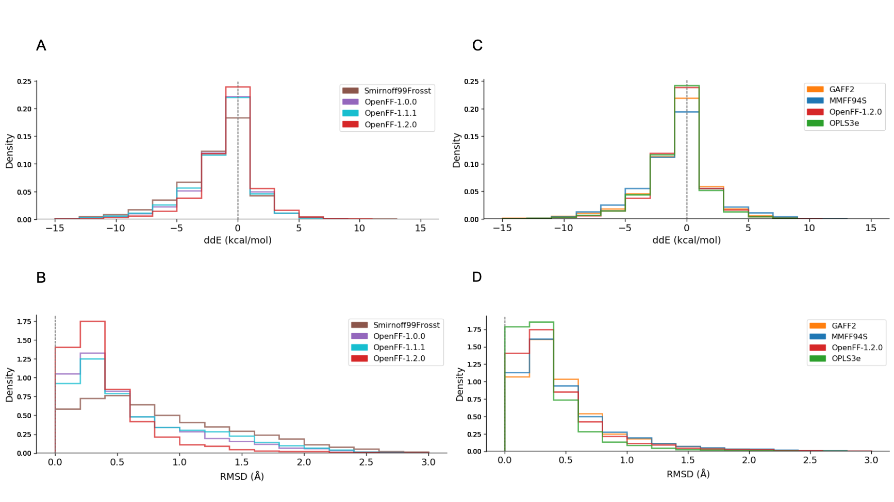

The past few months have been very productive in the Open Force Field Initiative! To make it easier to keep everyone up to date, we are introducing quarterly newsletters listing our key activities. This newsletter will be shared every three months on our website, mailing list and social media, starting this August. We will also continue our regular updates when we have new toolkit and Open Force Fields releases, or when other important events take place. You can now also follow the OpenFF Initiative on [LinkedIn](https://www.linkedin.com/company/openforcefield/).

This introductory newsletter will start as a hefty double issue covering last two quarters (Q2/Q3 2020). Let’s start!

## March 2020

In March, we welcomed two new software scientists in the OpenFF team - [David Dotson](https://www.linkedin.com/in/dotsdl/) and [Matt Thompson](https://www.linkedin.com/in/matt-thompson-57501717/). We are very excited (and lucky) to have them onboard and we can say without any doubt that their presence and talent have certainly helped us to pick up the pace in the infrastructure development! If you want to know more about them, check out their work on GitHub or follow them on Twitter:

* David: [GitHub](https://github.com/dotsdl) | [Twitter](https://twitter.com/dotsdl)
* Matt: [GitHub](https://github.com/mattwthompson) | [Twitter](https://twitter.com/mwt_dev)

The beginning of the global COVID-19 pandemic also gets the honorable mention in this section. Being already a highly delocalized team in the pre-pandemic era, we were accustomed to a fair share of Zoom meetings, but we are all looking forward to more opportunities to interact in-person!



## April 2020

The OpenFF Initiative has been awarded an NIH Focused Technology Research & Development R01 grant, enabling us to partner with the biopolymer force field community and extend our infrastructure and force fields to also cover biopolymers. This is a collaborative NIH grant, with $380K direct costs/year for four years shared over the five main academic sites (UC Boulder, MSKCC, UC Irvine, UC San Diego, and UC Davis), and includes significant funded collaborations with the MolSSI QCArchive and the AMBER community (via David Cerutti at Rutgers). The NIH funding is synergistic to the existing industrial Open Force Field Consortium funding, which focuses on delivering small molecule force fields with systematic improvements to accuracy and coverage. Read more about the goals of this grant in this [blog post](https://openforcefield.org/community/news/general/openff-nih-funding/) or in the [submitted proposal](https://openforcefield.org/community/news/general/seeking-nih-funding/2019-03-05-OpenFF-R01-proposal.pdf). Big thanks to our partners who contributed letters in support of the proposal!



## May 2020

#### Virtual meeting
On May 4-5, thanks to the aforementioned pandemic, we successfully substituted our planned in-person workshop in Boston with a [virtual meeting](https://openforcefield.org/community/news/general/may-2020-virtual-meeting/), although we must admit that discussion quality has somewhat suffered in this virtual format. Nevertheless, we were able to present all recent OpenFF achievements, current research activities and future plans in a form of excellent pre-recorded talks by the OpenFF team members. We would recommend watching these talks on YouTube ([playlist](https://www.youtube.com/playlist?list=PLYW6oF6nr8NvIK8WxkeE4Q0RbTePGbkXW)) to anyone interested in OpenFF science and infrastructure, if you haven’t seen them yet. All slides and videos were made available [OpenFF Zenodo Community](https://zenodo.org/communities/openforcefield/?page=1&size=20), where you can also find other presentations and materials produced by the OpenFF team members. If you find any of it useful, please cite the materials using their assigned DOI. Since the material is available under a CC-BY license, you are welcome to reuse slides and other content in your own work as long as you give proper credit.

#### OpenFF Evaluator
[OpenFF Evaluator](https://github.com/openforcefield/openff-evaluator), formerly known as `propertyestimator`, has received a major makeover! [Simon Boothroyd](http://linkedin.com/in/simon-boothroyd-596a141a7) has released version [0.1.0](https://github.com/openforcefield/openff-evaluator/releases/tag/v0.1.0), which marks a significant milestone in the development of this project, and constitutes an almost full redesign of the framework with a focus on stability and ease of use. Due to this full redesign, it should be considered as an entirely new package -- no files produced by previous versions of this will work with this new release. Some of the new features include markedly improved documentation, support for RDKit (and significantly reduced dependencies on OpenEye toolkits), model validation, batching of properties, and clearer branding. Read more about OpenFF Evaluator and find tutorials on how to use it in its great [new documentation](https://openff-evaluator.readthedocs.io/en/v0.1.0/).

#### Conformer notebook
We've released a [CLI tool and example notebook](https://github.com/openforcefield/openforcefield/tree/master/examples/conformer_energies) for calculating SDF conformer energies and performing minimization using the OpenFF-1.1.0 (Parsley) force field. This is a fairly straightforward "cookbook"-style example, and should be easily extendable by users. Please let us know about any issues you encounter on the [Open Force Field Toolkit Issue Tracker](https://github.com/openforcefield/openforcefield/issues). This functionality has been delivered to you by [Jeffrey Wagner](https://www.linkedin.com/in/jeffrey-r-wagner/).



## June 2020

#### OpenFF-1.2.0
We have released the latest Parsley force field update, [OpenFF-1.2.0](https://zenodo.org/record/3872244)! This version has been fitted to the new, carefully designed quantum chemical dataset  and the successive benchmark results showed significantly improved performance in reproducing QM optimized geometries. From a science point of view, the largest performance increases result from better selection of training data, which is an important finding. Some of the highlights for this most recent update include:
Dramatically improved QM fitting dataset increases parameter quality across the board, for almost all molecules tested;
Improved treatment of phosphonate groups;
Substantial improvements to torsions for molecules with single bonds between a divalent nitrogen and a trivalent nitrogen.
Substantial improvements for tetrazoles and conjugated N-N bonds carried from OpenFF-1.1 version.

For more details, please see the [release notes](https://github.com/openforcefield/openforcefield-forcebalance/releases/tag/v1.2.0). The new files are also available in the `openforcefields conda` package. This release has been primarily driven by significant efforts of PhD students [Hyesu Jang](https://www.linkedin.com/in/ACoAAC1TBe8B2dhx4mtSqiPR6Gi8gLcRscOxyEo) and [Jessica Maat](http://linkedin.com/in/jessica-maat-2a1875119).

#### OpenFF Toolkit 0.7.0
The long-awaited release of the feature-loaded [Open Force Field Toolkit version 0.7.0](https://github.com/openforcefield/openforcefield/releases/tag/0.7.0)! This release introduces many new `Molecule` methods, support for partial bond order-based torsion interpolation, and support for the `ChargeIncrementModel` tag in the SMIRNOFF spec. Some of the new features include:

* Support for `ChargeIncrementModel` sections in force fields.
* Support for `ProperTorsion` _k_ interpolation in force fields using fractional bond orders.
* Support for AM1-Mulliken, Gasteiger, and other charge methods using the new `assign_partial_charges` methods.
* Support for AM1-Wiberg bond order calculation using either the OpenEye or RDKit/AmberTools backends and the `assign_fractional_bond_orders` methods.
* Initial (limited) interoperability with QCArchive, via `Molecule.to_qcschema` and `from_qcschema`.
* A `Molecule.visualize` method.
* Several additional `Molecule` methods, including state enumeration and mapped SMILES creation.

There are a few API and behavior changes and we recommend reading the [release notes](https://open-forcefield-toolkit.readthedocs.io/en/0.7.0/releasehistory.html) for a more detailed overview of OpenFF Toolkit 0.7.0. `conda` packages available now on the `omnia` channel for both Linux and MacOS. Single-file installers are available in the "assets" section of the [GitHub release](https://github.com/openforcefield/openforcefield/releases/tag/0.7.0). This toolkit is crucial in paving the way for our next-generation Sage force fields, which will begin using Wiberg bond order-based torsion interpolation to improve torsion accuracy and generality. So, big congratulations [Jeff Wagner](https://www.linkedin.com/in/ACoAAAZiNckB6gIfYSxxudSGrqBE90wvdqTqiRU) and the team!

#### Publications/Preprints:

1. **Yudong Qiu**, Daniel Smith, Chaya Stern, Mudong Feng, Hyesu Jang and Lee-Ping Wang: _Driving torsion scans with wavefront propagation_, [J. Chem. Phys. 152, 244116 (2020)](https://doi.org/10.1063/5.0009232).

    [ChemRxiv](https://chemrxiv.org/articles/Driving_Torsion_Scans_with_Wavefront_Propagation/12044673/1)  |  [GitHub](https://github.com/https://github.com/lpwgroup/torsiondrive/)

    _Abstract:_ In this paper, we propose a systematic and versatile workflow called TorsionDrive to generate energy-minimized structures on a grid of torsion constraints by means of a recursive wavefront propagation algorithm, which resolves the deficiencies of conventional scanning approaches and generates higher quality QM data for force field development. The method is implemented in an open-source software package that is compatible with many QM software packages and energy minimization codes. The paper also describes integration with the [MolSSI QCArchive](https://qcarchive.molssi.org/) distributed computing ecosystem.

2. **Victoria T. Lim**, David F. Hahn, Gary Tresadern, Christopher I. Bayly, and David L. Mobley: _Benchmark Assessment of Molecular Geometries and Energies from Small Molecule Force Fields_

    [ChemRxiv](https://doi.org/10.26434/chemrxiv.12551867.v2)  |  [GitHub](http://github.com/https://github.com/MobleyLab/benchmarkff)

    _Abstract:_ In this work, we aim to compare six force fields: GAFF, GAFF2, MMFF94, MMFF94S, SMIRNOFF99Frosst, and the OpenFF-1.0.0 (Parsley) force field by focusing on small molecules (< 50 heavy atoms). On a dataset comprising over 26,000 molecular structures, we analyzed their force field-optimized geometries and conformer energies compared to reference quantum mechanical (QM) data. We show that most of these force fields are comparable in accuracy at reproducing gas-phase QM geometries and energetics, but that GAFF/GAFF2/Parsley do slightly better in reproducing QM energies and that MMFF94/MMFF94S perform slightly better in geometries. Parsley shows considerable improvement over its predecessor SMIRNOFF99Frosst, and we identify particular outlying chemical groups for further force field improvement. We also find that the series of recent Open Force Field versions provide significant increases in accuracy. Our molecule set and results are available for other researchers to use in testing.



## July 2020

#### OpenFF Toolkit 0.7.1
This is the first of our patch releases on our new planned monthly release schedule. The notable new features of this release include:

* Updates for compatibility with the new 2020 OpenEye Toolkits release;
* The get_available_force_fields function; and
* The disregarding of pyramidal nitrogen stereochemistry in molecule isomorphism checks.

Read more in detailed release notes. `conda` packages available now on the `omnia` channel for both Linux and MacOS! Single-file installers are available in the "assets" section of the [GitHub release](https://github.com/openforcefield/openforcefield/releases/tag/0.7.1). This toolkit update has been brought to you by [Jeff Wagner](https://www.linkedin.com/in/ACoAAAZiNckB6gIfYSxxudSGrqBE90wvdqTqiRU) and [Matt Thompson](https://www.linkedin.com/in/matt-thompson-57501717/).

#### Change of role for Lee-Ping Wang
[Lee-Ping Wang](https://www.linkedin.com/in/lee-ping-wang-3ba083197/) (UC Davis) has decided to step down from his role as an OpenFF primary investigator and continue his involvement with the OpenFF Initiative in a co-investigator role. Dr. Wang is seeking a way to free up more time to explore some new and exciting research directions, which is the main motivation behind his decision to step down from the leadership role which comes with a fair share of management duties. You can read more about Dr. Wang’s motivation in [his letter](https://openforcefield.org/community/news/general/lpw-stepdown/).
The Open Force Field Initiative owes a great deal of its success to the work done by Dr. Wang and his lab members and we would like to publicly thank him and his lab for their huge contributions to the OpenFF success. We are excited about new opportunities ahead of Dr. Wang and the OpenFF Initiative, and we are looking forward to our continuing collaboration.



## August 2020

#### OpenFF performance on small molecule energies and geometries

We have some exciting results to share based on our preliminary benchmark assessment of several small molecule force fields (FF) compared to quantum mechanical (QM) results using gas phase energies and geometries of a set of molecule conformers. The assessment includes GAFF1, GAFF2, MMFF94, MMFF94S, OPLS3e, Smirnoff99Frosst, and Parsley family ([OpenFF-1.0.0](https://doi.org/10.5281/zenodo.3483227), [OpenFF-1.1.1](https://doi.org/10.5281/zenodo.3695094), [OpenFF-1.2.0](https://doi.org/10.5281/zenodo.3872244)). The benchmarking study was based on Victoria Lim’s work as reported in the preprint highlighted above and extended to include several additional force fields, which led to an updated preprint version. The results on the used benchmarking datasets show that Parsley, and OpenFF-1.2.0 version in particular, is competitive with other small molecule force fields at much lower number of parameters (333 lines of parameters for OpenFF-1.2.0). Namely, obtained data suggests that OpenFF-1.2.0 is modestly superior to MMFF94S and GAFF2 and lags only slightly behind OPLS3e. Comparison between different Parsley versions demonstrated improvements in each iteration in our force field series. For a quick overview of the main results, check our [blog post](https://openforcefield.org/community/news/general/benchmark-small-molecules/), but for more detailed insights, read Victoria’s [preprint](https://doi.org/10.26434/chemrxiv.12551867.v2). This Parsley benchmarking study is a teamwork effort by [Victoria Lim](https://www.linkedin.com/in/ACoAAAoD0XYBKrKkjIKFXrxOojmyHaH0DHfJPdw) (UCI), [David Hahn](https://www.linkedin.com/in/davidfriedrichhahn/) (Janssen), [Gary Tresadern](https://www.linkedin.com/in/gary-tresadern-1655214/) (Janssen), [Christopher Bayly](https://www.linkedin.com/in/christopher-bayly-b1341021/) (OpenEye) and [David Mobley](https://www.linkedin.com/in/david-mobley-1b09724/) (UCI).

#### Preprints

1. **Chaya D. Stern**, Christopher I. Bayly, Daniel G. A. Smith, Josh Fass, Lee-Ping Wang, David L. Mobley, and John D. Chodera: _Capturing non-local through-bond effects when fragmenting molecules for quantum chemical torsion scans_

    [bioRxiv](https://doi.org/10.1101/2020.08.27.270934) | [GitHub](https://github.com/openforcefield/fragmenter)

    _Abstract:_ We show how the Wiberg Bond Order (WBO) can be used to construct small molecule fragmentation schemes that will avoid disrupting the chemical environment around torsions. The resulting fragmentation scheme powers the QCSubmit tool used to fragment and inject small molecule datasets into the QCFractal computation pipeline for deposition into the QCArchive quantum chemistry archive the Open Force Field Initiative uses for constructing force fields, as well as powering bespoke torsion refitting for individual molecules.

2. **Dominic Rufa**, Hannah Bruce Macdonald, Josh Fass, Marcus Wieder, Patrick Grinaway, Adrian Roitberg, Olexandr Isayev and John Chodera: _Towards chemical accuracy for alchemical free energy calculations with hybrid physics-based machine learning/molecular mechanics potentials_

    [bioRxiv](https://www.biorxiv.org/content/10.1101/2020.07.29.227959v1)  |  [GitHub](http://github/choderalab/perses)

    _Abstract:_ The authors combine a new generation of hybrid ML/MM potentials and a nonequilibrium perturbation approach to predict protein-ligand binding affinities. With this approach, a standard, GPU-accelerated MM alchemical free energy calculation can be corrected in a simple post-processing step to efficiently recover ML/MM free energies, while delivering a significant accuracy improvement with small additional computational effort. The authors show that it is possible to significantly reduce the error in absolute binding free energies with this new hybrid ML/MM approach ANI2xx/AMBER14SB/TIP3P on Tyk2 benchmarking system. The most exciting finding for the OpenFF Initiative is that the same set of FE calculations performed with OpenFF-1.0.0 (our first optimized FF) achieves RMSE statistically indistinguishable from [the Schrodinger JACS result](https://pubs.acs.org/doi/10.1021/ja512751q) for the tested system, which implies that we should expect even better results with the latest Parsley update (OpenFF-1.2.0).

 

#### New website

In case you haven't noticed, we have a [new website](https://openforcefield.org/)! Now you can find more information about the past, current and future activities of the Open Force Field Initiative, our force fields and software, how to engage with us and more content, such as news, science updates, webinars and more. We would like to make the website as informative and user friendly as possible so let us know what you think, we're open to constructive feedback, whether it's good or bad.
