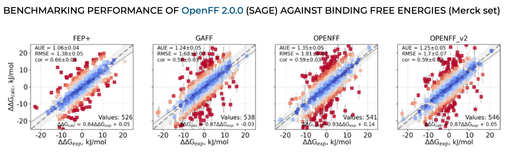

<br>

We're pleased to announce that [OpenFF 2.0.0](https://github.com/openforcefield/openff-forcefields/releases/tag/2.0.0), the first release of the Sage line of force fields, is now available to download! It contains our first set of retrained Lennard-Jones parameters in addition to continued improvements to the valence parameters. The easiest way to access the latest force field files is to install the latest version of the [openff-forcefields](https://github.com/openforcefield/openff-forcefields) package:

`conda install --yes -c conda-forge "openff-forcefields >=2.0.0"`

and load the force field via the toolkit:

```python
from openff.toolkit.typing.engines.smirnoff import ForceField

openff_2_0_0 = ForceField("openff-2.0.0.offxml")
```

If you experience any issues with the new force field, please be sure to email support@openforcefield.org or raise an issue on the [openff-sage](https://github.com/openforcefield/openff-sage) GitHub repository. This repository also contains the scripts, inputs and the results generated as part of the training the Sage line of OpenFF force fields.

Benchmarks against the public industrial partner benchmark set have shown positive improvements across the board, with OpenFF 2.0.0 remediating a slight regression in reproducing relative energy differences (ddE) between the OpenFF 1.3.0 force field and our default QM method, and shown an improved ability to reproduce minimum energy QM geometries (see image below).


Moreover, benchmarks of OpenFF 2.0.0 against the [Merck set](https://chemrxiv.org/engage/chemrxiv/article-details/60c747cc469df43efff438b9) of protein-ligand binding free energies by David Hahn and Vytautas Gapsys have begun to show serendipitous improvement (see below).



Although we did not target improvements to such properties for this release, such a positive improvement is further evidence that the process by which OpenFF builds its force fields is robust moving forward!

A huge thanks to the whole OpenFF team, our industrial partners, and our collaborators for making this release possible! :tada:
