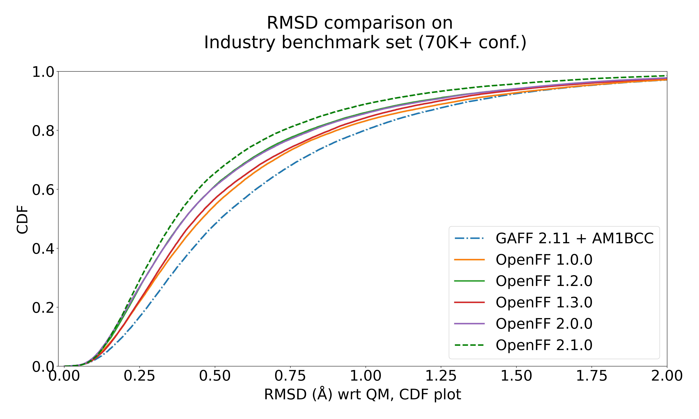
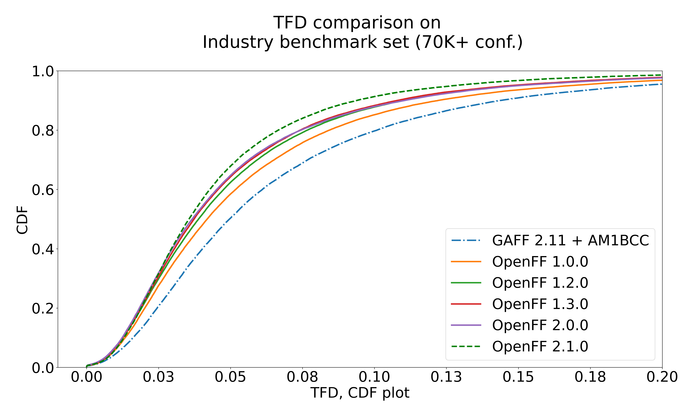
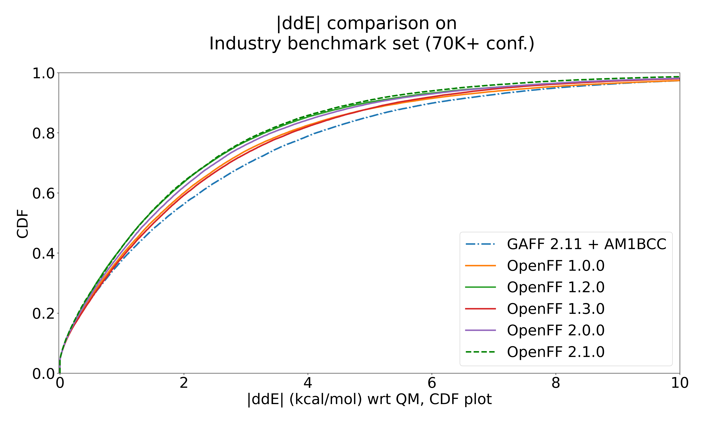
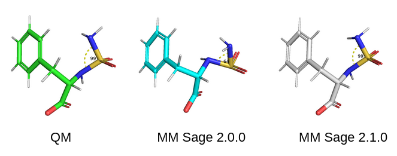

<br>

#### Release date: May 2, 2023

<br>

We're pleased to announce that [OpenFF 2.1.0](https://github.com/openforcefield/openff-forcefields/releases/tag/2023.05.1), the first parameter refit of the Sage line of force fields, is now available to download! This minor release consists of updates to openff-2.0.0 which include improved chemical perception for sulfonamides and phosphates, extended training set coverage which now contains training data from Gen2 as well as Gen1 datasets, and improved fitting procedures with the use of a physically intuitive starting point from Modified Seminario and including dihedral deviations in optimized geometry targets, and optimizing impropers as well. Contributions for this release include changes from Pavan Behara, Trevor Gokey, Chapin Cavender, Josh Horton, and valuable feedback from David Mobley, Hyesu Jang, Lily Wang, Simon Boothroyd, Christopher Bayly, Daniel Cole, and the OpenFF team.

The easiest way to access the latest force field files is to install the latest version of the [openff-forcefields](https://github.com/openforcefield/openff-forcefields) package:
`conda install --yes -c conda-forge "openff-forcefields >=2.1.0"`
and load the force field via the toolkit:
```python
from openff.toolkit.typing.engines.smirnoff import ForceField
openff_2_1_0 = ForceField("openff-2.1.0.offxml")
```
If you experience any issues with the new force field, please be sure to email support@openforcefield.org or raise an issue on the [openff-sage](https://github.com/openforcefield/openff-sage) GitHub repository. This repository also contains the scripts, inputs and the results generated as part of the training the Sage line of OpenFF force fields.
Changes can be broadly classified as:
   * Chemical typing related
       * sulfonamides
       * phosphates
       * bridgehead nitrogens
       * bridgehead carbons
       * groups with delocalized charges
   * Fitting procedure related
       * use of physically intuitive bonds and angles from modified-seminario as a starting point
       * data-driven values for improper torsions
       * including dihedral deviations from optimized geometries to better resolve torsion parameters
       * broader coverage of parameters with extended training targets

Benchmarks against the public industrial partner benchmark set have shown positive improvements across the board, with OpenFF 2.1.0 showing notable improvement in reproducing QM optimized conformer geometries as measured by RMSD and Torsion Fingerprint Deviation (TFD), while still improving on reproducing QM conformer energies (ddE).





Find more details in the [release notes](https://github.com/openforcefield/openff-sage/releases/tag/2023.05.1), including how to re-run optimization and datasets used in training stored in [sage-2.1.0](https://github.com/openforcefield/sage-2.1.0) repo.



A huge thanks to the whole OpenFF team, our industrial partners, and our collaborators for making this release possible! :tada:
