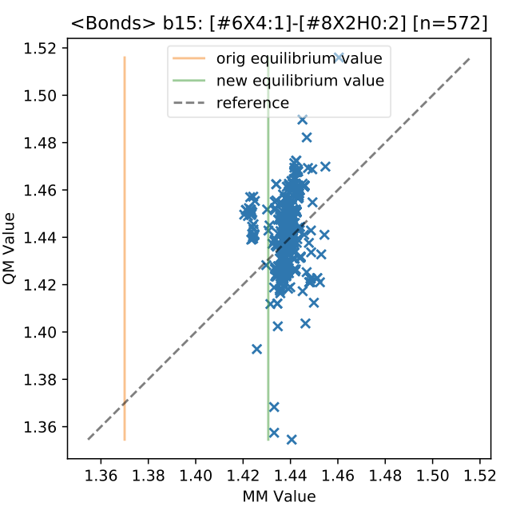

#### **Types**
We will use the same typing tree as smirnoff99Frosst (with some minor adjustments to specific bugs or other problems), but optimize the differentiable parameters in (a subset of) torsion, valence, and Lennard-Jones parameters.

#### **Parameterization**
We will aim to refit (a subset of) torsions, valence terms, and Lennard-Jones parameters, depending on what is ready in time. In practice, we have decoupled efforts to fit all three that should be straightforward to couple together in our final optimization stage.

#### **Datasets for parameterization**
We are in the process of generating/curating datasets that will go into the refit. Current molecule sets:

 * [Roche set:](https://github.com/openforcefield/open-forcefield-data/tree/master/Torsion-Drives/Roche-Reference-Compounds) Contains 468 small, chemically diverse molecules. Currently, nearly all 1-D torsions have been completed, geometries have been optimized and hessian calculations are running.
* [Coverage set:](https://github.com/openforcefield/qca-dataset-submission/tree/aae895e03a402910ac389e6b5dcb5686c1e9fceb//2019-06-25-smirnoff99Frost-coverage)  An initial set of 68 molecules which exercises 305 parameters from smirnoff99Frosst (all but 17 parameters), currently undergoing geometry optimization. This set has been supplemented by additional 12 molecules which would exercise the full set of parameters. However, there are a couple of minor issues:

  - Some molecules with unusual bonds dissociate during geometry optimization, e.g. c1cc(n(c1O)Br)[O-] or c1cc(n(c1[O-])I)[O-] or C1CC(=O)N(C1=O)I
  - BCCs are missing for some molecules, preventing charging (we are looking into a work-around for this)
  - This means that the set lacks 20 parameters in total (https://github.com/openforcefield/openforcefield/issues/375#issuecomment-508529674 ), not counting any additional ones we pick up from the coverage set.

* [eMolecules discrepancies:](https://github.com/openforcefield/qca-dataset-submission/pull/21) A set of (small) molecules which differ substantially in geometry between smirnoff99Frosst and other force fields (GAFF, GAFF2, MMFF), compiled in the Mobley lab.
* [VEHICLe set:](https://github.com/openforcefield/qca-dataset-submission/tree/aae895e03a402910ac389e6b5dcb5686c1e9fceb/2019-07-02%20VEHICLe%20optimization%20dataset) A set of heteroaromatic rings of the future containing 23,000 molecules, geometry optimizations have started.
* [Boron dataset](https://github.com/openforcefield/qca-dataset-submission/tree/aae895e03a402910ac389e6b5dcb5686c1e9fceb/2019-07-05%20OpenFF%20NCI250K%20Boron%201) in preparation.
* [Genentech set](https://github.com/openforcefield/open-forcefield-data/pull/30) provided: A set of compounds derived from the pdb that used by A. Gobbi for testing their strain energy calculator. Those would include molecules with MW < 500 and the number of rotational bonds <= 6, and separated into charged and uncharged.
* Other possibilities: [DrugBank](https://www.drugbank.ca/), [Enamine](https://enamine.net/) subsets, and [Ligand Expo](http://ligand-expo.rcsb.org/) will be examined further for additional coverage

#### **Torsions**

* Neutral molecules used for fitting at the moment, no expansion to tautomers and other protonation states yet. These include molecules from Roche set (Group 1) and “Coverage set” (Group 2).
* Current level of theory used is B3LYP-D3BJ/DZVP and the rationale for using it is provided [here](https://openforcefield.org/community/news/science-updates/2019-05-16-condicj/). Further benchmarking study is necessary to determine an appropriate level of theory for anions (and torsions in general).
* Looking for more molecules to increase chemical coverage and torsional diversity, and possibilities around automating this task.
* [ForceBalance](https://github.com/leeping/forcebalance) fitting will vary k with weak restraints and not change periodicities or phases at this stage.The effect of changing periodicity will be examined on several selected molecules (tests to be performed).

**Torsion fitting protocol**

* QC data generation pipeline:

1. Process input molecules, write one molecule per file. (Fragmentation can be done here in the future).
2. For each molecule, identify interested torsions for scanning. Roche set (Group 1): center bond not in ring, all heavy atoms, one torsion per center bond, resulting with 819 1-D torsions.
3. Submit torsion scan to QCFractal server, run torsiondrive using B3LYP-D3BJ/DZVP method (24 points of evenly spaced torsion angles in 15° increments).
4. Download data from QCFractal server.
5. Format downloaded data into ForceBalance fitting targets. Data includes QM relative energies and gradients along torsion rotation profile.

* Fitting Data with ForceBalance:

1. Select fitting parameters by annotating the offxml file (automated).
2. Organize all fitting targets (automated).
3. Select fitting options for optimizer and fitting targets (manual, based on experience).
4. Run ForceBalance.
5. Analyze fitting results.

* ForceBalance Fitting Results -- all scripts, data files, input/output files are versioned and detailed steps are documented in the published [release](https://github.com/lpwgroup/forcebalance-qcarchive/release).ForceBalance-Manager Demo: https://vimeo.com/344867533.

**Notes:** Agreement between MM and QM torsion profile varies among fitting targets. Some matches exactly and some are completely off. Further investigation on the problematic targets is needed. For each problematic target, we can identify relevant parameters and run short fittings, and try with increased number of phases.

#### **Valence**

Hessians currently in progress, but some initial fitting was based on torsion scan data and geometry optimization calculations. Force constants are expected to change more once Hessians will be included. Currently there is not that much data to constrain bond/angle force constants. An example of bond fitting is given below.

**Notes:** Fitting all valence parameters (bonds, angles & torsions) for Roche set torsion profile data resulted with parameter coverage 261/508, ForceBalance objective function decreased from 1280 --> 480 in 6 non-linear steps. Since the QM gradients are all near zero, the MM force constants are reduced substantially in fitting. This indicates that the QM gradients from the torsion profiles are not sufficient for fitting MM valence force constants.

Overall parameter changes are plotted and shown [here](param_change.pdf), where green color is associated with increase in value and red with decrease. More of the latest fitting results can be found [here](https://github.com/lpwgroup/forcebalance-qcarchive/releases/tag/v0.0.3).

#### **Properties (Lennard-Jones)**

* NIST update: Data that was collected and curated in an automated process could be released as an open dataset, but not the manually curated uncertainties, which is the step that follows automated curation.
* Data from before 10 years ago isn’t present in ThermoML and this data may not be available in the same format, or at all.
* Additional sources, such as https://www.aiche.org/dippr/events-products/801-database or http://www.ddbst.com/free-data.html have been suggested to make up for any missing properties / compounds.
* Release-1 will rely on the data we have now -- an old version of released ThermoML, unless newer data will be ready in time.
* Properties to be used in the first optimization sprint (for LJ fitting) will include heats of vaporization (Hvap), densities and dielectric constants of pure substances, and mixtures could potentially be [used for validation.](https://openforcefield.org/community/news/science-updates/propertyestimator-meeting-2019-06-27/).
* An appropriate chemical coverage set (specific moieties vs. specific molecules) needs to be built. L.-P. Wang’s suggested list of molecules based on S. Boothroyd’s initial filtering is [here](https://docs.google.com/document/d/1NkmN0VWix2pcA094vcEC-3VeA1qhmgszzdCbMTQP-Ow/edit).
* [PropertyEstimator](https://github.com/openforcefield/propertyestimator) and [ForceBalance](https://github.com/leeping/forcebalance) are making [progress](https://github.com/yudongqiu/forcebalance/pull/7) on building the interface, and PropertyEstimator should be used to compute gradients.

More information about progress and scientific discussions during the subgroup meetings can be found [here](https://openforcefield.org/science/). The upcoming meeting dates can also be found on the same page. Discussion about the details of the first force field optimization sprint takes place in `#release-1` channel in Slack.

#### Future perspective

**Charges:** M. Schauperl wrote an [update](https://openforcefield.org/community/news/science-updates/2019-07-05-charge-model-update/) recently about the RESP2 model performance on a limited set of molecules.

#### OpenFF Toolkit

OpenFF Toolkit is heading towards 0.5.0 release -- list of [open](https://github.com/openforcefield/openforcefield/milestone/6) and [closed](https://github.com/openforcefield/openforcefield/milestone/6?closed=1) milestones is on GitHub. Implementation of GBSA is causing delay in the next release (this is also because Jeff Wagner is at the CADD GRC conference this week).
