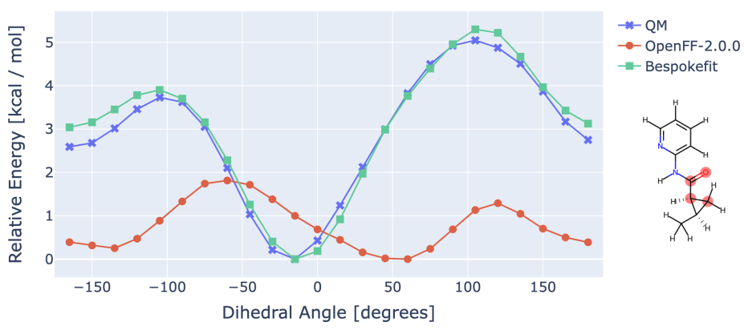
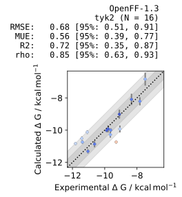
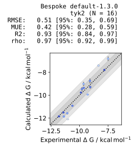

We are very pleased to officially announce the release of :tada:[OpenFF-Bespokefit](https://github.com/openforcefield/openff-bespokefit):tada: for public use. The BespokeFit framework aims to offer a completely automated workflow for creating bespoke, highly accurate, torsion parameters in the OpenFF SMIRNOFF format. Following our very early
[alpha preview](https://openforcefield.org/community/news/science-updates/bespokefit-update-2021-10-20/) late last year we have been hard at work to improve the experience that users can expect with Bespokefit, concentrating on a few key aspects:
- **Reliability**: Bespokefit should be able to reliably derive bespoke parameters for a wide range of drug-like molecules and so we have reworked our reference data generation to work with the fantastic [QCEngine](https://github.com/MolSSI/QCEngine) to offer a reliable and reproducible fitting experience. 
- **Scalability**: In order to be effective we need to fit parameters at scale and so the schema execution workflow has been reworked from the ground up to offer a scalable server, worker implementation allowing users to configure resources to individual stages of the workflow.
- **Speed**: To decrease fitting times when possible Bespokefit now uses an internal caching mechanism that enables the results from each stage to be saved and reused, including bespoke parameters.
- **Usability**: The CLI has been expanded to make the fitting experience as convenient as possible with sensible defaults which provide a consistent derivation protocol with that of the base force field. Optional flags also allow users to augment the fitting procedure, however, without needing to touch a line of code.
- **Documentation**: To help users get set up quickly and learn more about how Bespokefit works under the hood we now have an extensive set of documentation thanks to [Josh Mitchell](https://docs.openforcefield.org/projects/bespokefit/en/latest/).

# Validation

In order to ensure the correct behavior of the reworked Bespokefit we have been putting it though its paces, and now highlight some use cases from a forthcoming publication which hopefully demonstrate the value and usability of Bespokefit. 

## Parameters at scale
To highlight the ability of Bespokefit to fit bespoke torsion parameters at scale we have chosen to derive parameters for 
fragments of a [benchmark ligand dataset](https://doi.org/10.1021/ja512751q). This well known community benchmark is often used 
to assess force field accuracy via absolute or relative binding free energy calculations in a typical drug discovery setting. 
The dataset comprises 199 ligands taken from 8 different lead series and includes a mixture of net charges and chemical 
moieties and provides considerable challenge to state-of-the-art force fields. 

We began by fragmenting the molecules using 
[OpenFF-Fragmenter](https://github.com/openforcefield/openff-fragmenter) to reduce the computational cost of generating 
the torsion drive reference data. This resulted in 490 unique molecules and 
671 torsion drives which were computed using our default force field fitting QM specification (B3LYP-D3BJ/DZVP via [Psi4](https://psicode.org/)) 
using [QCFractal](https://github.com/MolSSI/QCFractal) and are publicly available on [QCArchive](https://qcarchive.molssi.org/)
under the dataset name ``OpenFF-benchmark-ligand-fragments-v2.0``. We then downloaded these reference data into a local 
Bespokefit fitting server which allows us to search the dataset for fragment-specific torsion drives, a feature which is not 
currently available in QCFractal. All the fragments were then processed using the default fitting procedure, resulting in 
bespoke parameters consistent with the base choice of force field which in this case was 
[Sage](https://openforcefield.org/force-fields/force-fields/) (OpenFF-2.0.0.offxml). 
Once the unique torsion parameters had been derived we then assessed their accuracy by analysing how well the final force fields
are able to recover the QM geometries (Max RMSD between QM and MM optimized geometries) and energies (RMSE between QM and MM potential energy surfaces). The results are shown in the table below for both Sage, and Sage modified with 
Bespokefit derived torsions. As expected, the bespoke parameterization shows a clear improvement in the potential energy surface across the 
set of 671 torsion scans, with the average RMSE reducing from 1.1 (base Sage) to 0.4 kcal/mol (Sage with bespoke torsion parameters). 
The relaxed geometries predicted by the force field are also affected by the other valence terms, and so perfect agreement 
with QM is not expected.

| Force Field         | Max RMSD / Angstrom | RMSE / kcal/mol |
|---------------------|:-------------------:|:---------------:|
| Sage (OpenFF-2.0.0) |        0.652        |      1.096      |
| Bespoke Sage        |        0.614        |      0.419      |

The figure below emphasizes the accuracy improvements in the torsional potential energy surface when using a Bespokefit optimized force field 
compared to the base state-of-the-art general force field.

## Binding free energies
The ultimate goal of our bespoke parameterization is to improve force field accuracy for typical applications in drug discovery, such as 
binding free energy calculations.
Here we have chosen to compute relative binding free energies for the congeneric series of inhibitors 
of the TYK2 protein parameterized with Parsley version 1.3.0 (OpenFF-1.3.0.offxml), supplemented by bespoke torsion parameters. 
The following figures show the results of the relative binding free energy calculations with both the base OpenFF-1.3 FF (left)
and the Bespokefit augmented counterpart (right). As can be seen from the ∆G plots the base OpenFF-1.3.0 FF provides competitive 
performance on this dataset with the desired sub 1 kcal/mol performance. The Bespokefit version further
improves each of the measured statistics, without introducing any large errors. This indicates that our choice of fragmentation scheme
and default fitting pipeline has the potential to considerably improve the reliability of free energy calculations in more
challenging future test cases.

