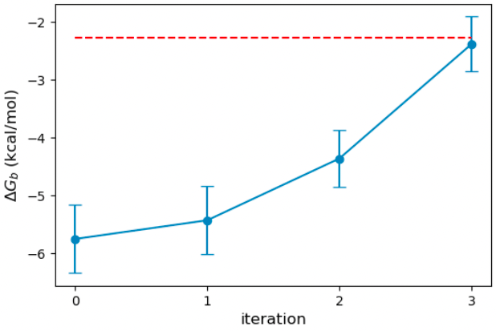

Would you like to train your force field to fit binding data? Most force 
fields are tuned to reproduce liquid state properties. Setting up simulations to perform the binding calculations and optimizing specific force field parameters may be laborious work. However, the Open Force Field infrastructure provides the tools to achieve this in an automated way. In this blog post, I will show an example of tuning GBSA parameters to host-guest binding data using Open Force Field. 

<b>Overview of the Workflow</b>

The main infrastructure for organizing the calculations is the OpenFF-Evaluator (or Evaluator for short) package. Evaluator provides the infrastructure for calculating properties such as liquid state properties and solvation free energy in an automated and scalable fashion. The following steps are the typical workflow in Evaluator:

* Prepare the training data for the particular physical property of interest
* Specify the simulation settings (number of water molecules, length of simulations, etc.)
* Configure the Evaluator server 
* Distribute the workload in a local or distributed cluster
* Query the results

The binding calculation in Evaluator is based on absolute binding free energy (ABFE) using the attach-pull-release (APR) method. Evaluator integrates the pAPRika python package in its workflow to automate the initial setup and analysis of the calculations. The optimization of force field parameters is done by ForceBalance, which takes the results from Evaluator as input. For host-guest binding calculations, the data is fetched from the Taproom repository. The metadata in Taproom contains information on the experimental value and the specifics of the calculations. A diagram visualizing the optimization workflow is shown in figure 1.


<b>NOTE</b>

The infrastructure in Evaluator for host-guest binding is still experimental, and the API is subject to change.

<b>NOTE</b>

Currently, running host-guest binding calculations in Evaluator requires an OpenEye license.


In the following, I will show snippets of the python script I used to run the force field optimization. The installation instruction and the complete code are available in this [GitHub repository](https://github.com/jeff231li/HG-GBSA-Optimization).

<b>Preparing the Training set</b>

For this example, I will use the hexanoate acid (hex) bound to beta-cyclodextrin (bcd) as the host-guest complex for the training set. The following are snippets from the file [optimization-FB-host-guest.py](https://github.com/jeff231li/HG-GBSA-Optimization/blob/main/optimization/optimization-FB-host-guest.py). We specify the host-guest complex with the `TaproomDataSet` module in Evaluator. 

```python
from openff.evaluator.datasets.taproom import TaproomDataSet

host_guest_data_set = TaproomDataSet(
    host_codes=["bcd"],
    guest_codes=["hex"],
    in_vacuum=True,
)
```
Since we are simulating the system in implicit solvent, we set the argument `in_vacuum` to True, which will skip the solvation part when we create the system. The command above will extract information from Taproom for the specified host-guest complex.

<b>Preparing the force field</b>

Here, we will use the Sage force field version 2.0.0 and the OBC1 model for the implicit solvent. The GBSA parameters are not yet stored in the OpenFF-ForceField package and are still experimental. Currently, the GBSA parameters are located in the OpenFF-Toolkit, and we will use utils from `pkg_resources` to find the file. The force field is thus initiated with:

```python
from openff.toolkit.typing.engines.smirnoff import ForceField
from pkg_resources import resource_filename

# Define the force field.
GBSA_OBC1 = resource_filename(
    "openff.toolkit",
    os.path.join("data", "test_forcefields", "GBSA_OBC1-1.0.offxml"),
)
force_field = ForceField("openff-2.0.0.offxml", GBSA_OBC1)
```

Next, we tag the GB radius of the oxygen atom by adding a cosmetic attribute to the force field. This tag will tell ForceBalance which force field parameter to optimize.
```python
gbsa_handler = force_field.get_parameter_handler("GBSA")

for smirks in ["[#8:1]"]:
    parameter = gbsa_handler.parameters[smirks]
    parameter.add_cosmetic_attribute("parameterize", "radius")
```
When we save the force field to a file, we will see an additional attribute for the oxygen atom `parameterize=”radius”`.

<b>Configuring the simulation settings</b>

In the next part of the code, we specify the length of time we want to simulate each window. We will need to specify the simulation length for the main APR calculations and the end-states. The end-states calculations are used to estimate the free energy gradient with respect to the force field parameter. The end states are simulated for much longer and are used to estimate the free energy gradient with respect to the force field parameter. For this example, I used a short simulation time, but a much longer time is needed for the production run.

```python
from openff.evaluator.properties import HostGuestBindingAffinity
from openff.evaluator.protocols.paprika.openmm import APRSimulationSteps

# Set up the calculation
simulation_settings = APRSimulationSteps(
    n_thermalization_steps=25000,
    n_equilibration_steps=100000,
    n_production_steps=500000,
)
gradient_settings = APRSimulationSteps(
    n_thermalization_steps=25000,
    n_equilibration_steps=100000,
    n_production_steps=5000000,
)
host_guest_schema = HostGuestBindingAffinity.default_paprika_schema(
    simulation_settings=simulation_settings,
    end_states_settings=gradient_settings,
    use_implicit_solvent=True,
)
```

<b>Launching the server</b>

Next, we define the calculation backend to specify the resources available for the calculation. In the snippet below, I specify 4 GPUs for a local cluster. See the [Evaluator documentation for running the calculations on a distributed cluster](https://docs.openforcefield.org/projects/evaluator/en/stable/backends/daskbackends.html).

```python
from openff.evaluator.backends import ComputeResources
from openff.evaluator.backends.dask import DaskLocalCluster

# Create Pool of Dask Workers
calculation_backend = DaskLocalCluster(
    number_of_workers=4,
    resources_per_worker=ComputeResources(
        number_of_threads=1,
        number_of_gpus=1,
        preferred_gpu_toolkit=ComputeResources.GPUToolkit.CUDA,
    ),
)
```

Once we have defined the training data, force field, simulation settings, and calculation backend, we launch the Evaluator server to distribute the calculations. In the following, we run the Evaluator server and ForceBalance in the background. ForceBalance requires an input file to specify the configuration that is provided in [optimize.in](https://github.com/jeff231li/HG-GBSA-Optimization/blob/main/optimization/optimize.in).

```python
import subprocess as sp
from openff.evaluator.server import EvaluatorServer

# Start the Evaluator Server
with calculation_backend:
    evaluator_server = EvaluatorServer(
        calculation_backend=calculation_backend,
    )
    with evaluator_server:
        # Run ForceBalance
        force_balance_arguments = ["ForceBalance.py", "optimize.in"]
        with open("force_balance.log", "w") as file:
            sp.check_call(force_balance_arguments, stderr=file, stdout=file)
```


<b>Results</b>

Once the ForceBalance run is complete, we can plot the objective function to see the convergence. The objective function in ForceBalance is defined as


where <i>N</i> is the number of types of properties (density, solvation free energy, HG binding free energy etc.), <i>M<sub>n</sub></i> is the total number of properties of type <i>n</i>, <i>Y<sub>m</sub><sup>ref</sup></i> and <i>Y<sub>m</sub>(Θ)</i> are the experimental and calculated values of property <i>m</i>, respectively. The <i>weight<sub>n</sub></i> value gives weight to different property types and <i>denominator<sub>n</sub></i> scales the difference between the experimental and estimated properties. In this calculation, we set both of these values to 1 and 1 kcal/mol, respectively. Below is the plot of the objective function vs the optimization iteration. We see that the objective function progressively decreases with each iteration and reaches near zero at iteration 3.


In addition to the objective function, we can plot the binding free energy from each iteration to see how well the optimization performed. We see that the binding affinity is greatly overestimated (about 4 kcal/mol) compared to the experiment with the original parameters (red dash line). ForceBalance improves the binding affinity with each iteration and reaches a very good value after three iterations of optimization. 



In the figure below, I plot the evolution of the oxygen GB radius. ForceBalance shrinks the GB radius with each iteration to improve the binding free energy. The optimized radius is 1.14 Angstrom, down from the initial 1.50 Angstrom.  


Finally, to assess the quality of the optimized parameter, I have run some [benchmark calculations with OpenFF-Evaluator without ForceBalance](https://github.com/jeff231li/HG-GBSA-Optimization/blob/main/optimization/optimize.in). Below are the results for βCD with cyclobutanol, cis-4-methyl cyclohexanol, and benzoate acid.


 
We see that reducing the oxygen GB radius significantly improves the binding free energy calculation. The root-mean-squared error (RMSE) decreases from 2.92 kcal/mol to 1.00 kcal/mol.

<b>Final Remarks</b>

In this blog, I have shown an example of optimizing GB radii to fit host-guest binding data. The results here show some promise, but a larger training set is needed for production. There are also several things to consider:
* Which parameters should be optimized (i.e. how sensitive are different GB parameters to binding affinity)?
* How transferable are the optimized FF parameters to other host-guest complexes?
* What happens to other physical properties when we only fit the FF parameters to HG binding?
* How well do host-guest fitted FF parameters perform in protein-ligand systems?

Although the example here optimizes GB radii, you can apply the same procedure to other FF parameters like Lennard-Jones. As our infrastructure evolves and the continual improvement of hardware, we can hope to be able to perform large-scale FF fitting to several physical properties, including HG binding to obtain an accurate FF for protein-ligand complexes.

