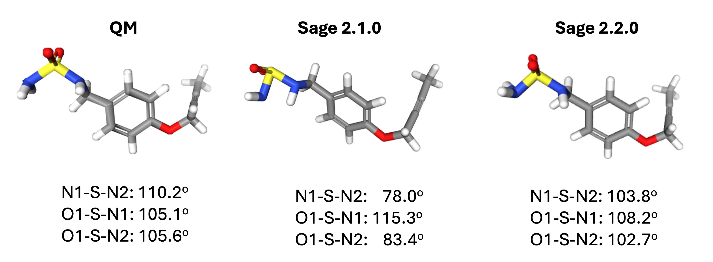
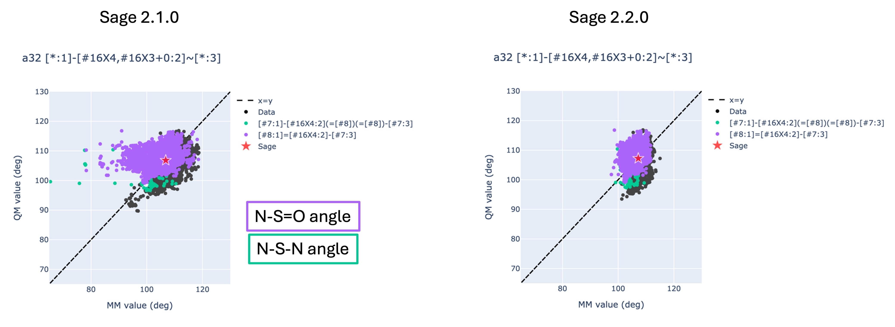

We are excited to share the release of our first **release candidate** of our newest force field, Sage 2.2.0! 
This force field builds upon our previous release, Sage 2.1.0, which is applicable to small, drug-like molecules.
The Sage 2.2.0 release candidate improves the geometries of epoxide groups and sulfamide groups, which suffered from large errors in Sage 2.1.0.
Both of these groups are important for medicinal chemistry and drug design, so we expect these improvements to be of great interest to the community.

However, please note that this is currently in the testing stage, and is not production ready.
If you'd like to help us test the release candidate, there are instructions at the end.

## Sulfamides
In Sage 2.0.0 and 2.1.0, often sulfamide groups show a greatly reduced N-S-N angle and both greatly reduced and slightly increased N-S=O angles.
In Sage 2.2.0, this issue has been fixed, as can be seen below.



To address this issue, we first noted that the force constant for `a32`, which covers both the N-S=O and N-S-N angle in the sulfamide functional group, was decreasing by more than 100 kcal/mol/rad<sup>2</sup> over the course of the FF fit compared to the starting value derived from quantum chemical data via the modified Seminario method.
This would make those angles around the S atom much more flexible than QM would suggest they should be, and impose less of a penalty for deviating from the ideal angle.
We expect the starting value to be a good estimate, so we reduced the amount that parameters are able to vary during optimization.
This led to an increased force constant and substantially improved sulfamide properties in Sage 2.2.0.
The median RMSD between a given MM-optimized conformer and its QM counterpart improved from 0.50 Å in Sage 2.1.0 to 0.34 Å in the Sage 2.2.0 release candidate for molecules containing the sulfamide group, and the mean absolute ddE for molecules containing the sulfamide group improved from 2.12 kcal/mol in Sage 2.1.0 to 1.71 kcal/mol in the Sage 2.2.0 release candidate.

The improvements can be seen clearly in the figures below. 
The two graphs show the angle value in the optimized conformer geometry for all angles described by `a32`, which includes both the N-S-N (green) and N-S=O (purple) angle in the sulfamide group. 
The y axis shows the value of the angle in the QM-optimized geometry, while the x axis shows the value in the MM-optimized geometry using Sage 2.1.0 (left) and the Sage 2.2.0 release candidate (right).
For the plot on the left-hand side where the MM conformers have been optimized with Sage 2.1.0, there are clearly a number of data points to the left of the x=y line, indicating that Sage 2.1.0 is producing angles that are much smaller than they should be.
However, the plot on the right-hand side does not show this feature, indicating improved performance in the Sage 2.2.0 release candidate.



## Epoxides
In Sage 2.1.0, parameters are assigned in a heirarchical fashion, so any parameter that comes later in the list supersedes a parameter that is listed earlier.
Our 3-membered ring internal angle is `a3`, which is third in the parameter order. 
However, for epoxide groups, the C-O-C internal angle was being overridden by `a28`. Parameter `a28` is a generic parameter covering any R-O-R angle, and it appears later in the parameter list and thus takes precedence.
Because `a28` is a generic parameter, its equilibrium value is around 112 degrees, which is appropriate for many R-O-R angles, but not for epoxide, which should be closer to 60. 
This led to substantially distorted geometries for the epoxide group, including increased C-O-C angles, decreased C-C-O angles, and increased C-C bonds.
This was fixed in Sage 2.2.0.


To address this, we moved the `a3` parameter to the end of the parameter list, ensuring it takes precedence over `a28`.
This resulted in substantially better geometries for the epoxide group.
The median RMSD between an MM-optimzied conformer and its QM counterpart decreased from 0.41 Å in Sage 2.1.0 to 0.31 Å in the Sage 2.2.0 release candidate, while the mean absolute ddE decreased from 1.97 kcal/mol in Sage 2.1.0 to 1.84 kcal/mol in Sage 2.2.0 release candidate.

The most straightforward way to highlight the improvements to molecules containing an epoxide group is to plot the RMS error in the bond lengths, angles, dihedral angles, and improper dihedral angles, which is shown below, comparing Sage 2.0.0, Sage 2.1.0, and Sage 2.2.0.
Note that the C-O-C epoxide angle was still covered by the generic `a28` angle in Sage 2.0.0, but that parameter has a much higher force constant in Sage 2.1.0, leading to the more distorted geometries.


## Other changes

A few other changes were also made in Sage 2.2.0, focused on 5-membered rings. You can see all the changes [here](https://github.com/openforcefield/sage-2.2.0/tree/main).

## Usage

While preliminary benchmarks of our Sage 2.2.0 release candidate look good, we can't have confidence in the force field until it has been tested by our users. 
We encourage you to download the force field and give it a try.
You can get access to the force field by installing the latest release of the `openff-forcefields` package on conda:

```bash
conda install -c conda-forge openff-forcefields==2024.03.0
```

The force field will then be loadable using our OpenFF toolkit:

```python
from openff.toolkit import ForceField

sage_220 = ForceField('openff-2.2.0-rc1.offxml')
sage_unconstrained_220 = ForceField('openff_unconstrained-2.2.0-rc1.offxml')
```

Please let us know what you think!
