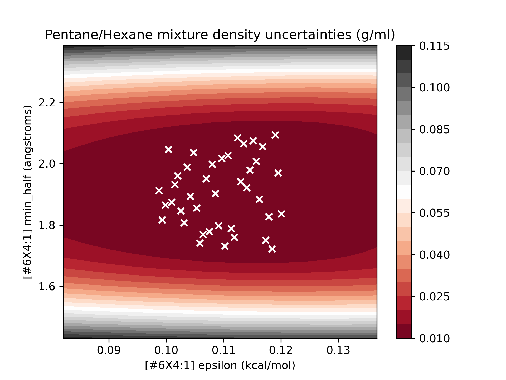
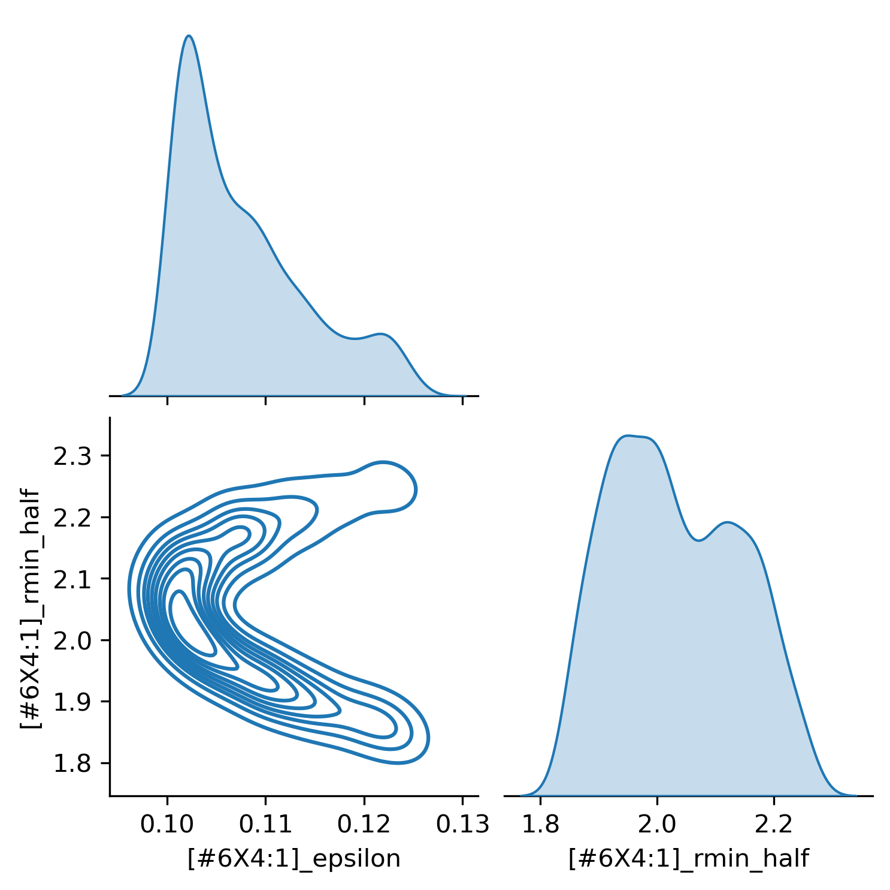

In the Open Force Field Initiative, we are always looking for novel ways to advance force field parameterization.
Working on the parameterization of Lennard-Jones models, one strategy I am exploring is using Bayesian inference to
explore parameter landscapes with respect to physical properties. This is a lot to parse in one sentence, so let's break
it down!

## Lennard-Jones parameterization relies on physical properties

Since the earliest days of force field science, LJ parameters have been fitted against physical property datasets (
typically liquid densities and heats of vaporization). This is an important step of parameterization because it fits the
critical LJ parameters and introduces macroscopic constraints that complement microscopic QM constraints.

The disadvantage of using physical property measurements in parameterization is that they are generally slow to
evaluate, because computing a physical property with a force field requires you to run an equilibrium simulation with
that force field. This makes it difficult to efficiently optimize LJ parameters or otherwise explore parameter space due
to computational constraints.

## Bayesian posterior sampling is a promising method of exploring parameter space

Bayesian inference is a paradigm for evaluating parameter sets that naturally incorporates *prior* information and a *likelihood* derived from experimental data into a *posterior* distribution, which can be used as a metric for fitness.
Bayesian inference is of interest to us because of a) the way that it parsimoniously incorporates previous model
knowledge, and b) because understanding the whole parameter distribution can find parameter sets that escape local
minima.

The catch, however, is that evaluating a Bayesian posterior distribution generally requires Monte Carlo simulation, and
is even more computationally expensive then most optimization schemes. So if we want to do Bayesian exploration of a
parameter probability distribution, we need a way to speed things up significantly. For us, this means we need a much
faster way of taking LJ parameter inputs (sigma/rmin_half, epsilon) and getting physical property outputs (densities,
enthalpies) very quickly.

## We can accelerate sampling with surrogate modeling

Fortunately, the physical properties we are interested in are relatively smooth functions of the LJ parameters in our
regions of interest, and can be approximated with simpler *surrogate models* with limited losses of fidelity. For our
surrogate models, we can use Gaussian Processes, which are simple surrogates that excel at making predictions (with
uncertainty) from a limited number of observations. The technique originated in geostatistics, where it is desirable to
understand mineral content over a wide area of space, but only feasible to take a limited number of samples. The
principle is the same here!

## Putting it together

In the rest of this post, we'll demonstrate:

1. Using the [OpenFF evaluator](https://openff-evaluator.readthedocs.io/en/stable/), automatically simulating and
   collating physical property measurements from simulation at a variety of parameter sets.
2. Using [GPytorch](https://gpytorch.ai/), building a surrogate model based off the outputs and uncertainties of these
   simulated measurements.
3. Using the [Pyro](https://pyro.ai/) probabilistic programming language to model a Bayesian posterior distribution, and
   then sampling from this distribution using the NUTS MCMC sampler to get the parameter landscape.

For the purpose of this demonstration, we'll focus on a simple example (easy to visualize!): building a surrogate model
for the density of a 50/50 mixture of pentane and hexane  (at STP), as a function of the epsilon and rmin_half of the
tetravalent carbon parameter `[#6X4:1]`.

 The Open Force Field infrastructure is currently rapidly evolving and so parts of this blog post may become
out of date as time progresses. This blog post also omits some of the implementation details for brevity, the code this
is adapted from (still under heavy development) is available [here](https://github.com/ocmadin/LJ_surrogates) 

## Simulating the density with respect to parameters

To start, we focus on the line from the OpenFF 1.3.0 `.offxml` that contains the `[#6X4:1]` (tetravalent carbon) LJ
parameters:

`<Atom smirks="[#6X4:1]" epsilon="0.1094 * mole**-1 * kilocalorie" id="n16" rmin_half="1.908 * angstrom"/>`

Using the OpenFF toolkit, it's easy to access and modify these parameters. In order to come up with some efficiently
spaced parameter sets, we use Latin hypercube sampling (from the SMT package)
to get samples from the range of 90-110% of the original parameters.

```python
import numpy as np
from smt.sampling_methods import LHS

xlimits = np.asarray([[0.9, 1.1], [0.9, 1.1]])
# Set the limits to sample within 90-110% of the original parameters (in 2D)
hypercube = LHS(xlimits=xlimits)
# Create LHS sampling object
num_samples = 40
samples = hypercube(num_samples)
# Create 40 samples from the hypercube
```

Here are the first 5 resulting hypercube samples:

```
array([[1.0725, 1.0025],
       [1.0275, 1.0925],
       [1.0125, 0.9425],
       [0.9225, 0.9475],
       [0.9825, 0.9175],
```

Taking the first Latin hypercube sample, we can easily use it to modify the force field:

```python
from openff.toolkit.typing.engines.smirnoff.forcefield import ForceField

forcefield = ForceField('openff-1-3-0.offxml', allow_cosmetic_attributes=True)
lj_params = forcefield.get_parameter_handler('vdW', allow_cosmetic_attributes=True)
# Get the forcefield from file and its LJ parameters
lhs_sample = [1.0725, 1.0025]
smirks_to_change = '[#6X4:1]'

lj_params[smirks_to_change].epsilon *= lhs_sample[0]
lj_params[smirks_to_change].rmin_half *= lhs_sample[1]
# Multiply the parameters of interest by the values from the LHS sample
forcefield.to_file('force-field.offxml')
# Save the result to file
print(lj_params[smirks_to_change])
# Show the changed parameters
```

```
<vdWType with smirks: [#6X4:1]  epsilon: 0.12583803375 kcal/mol  id: n16  rmin_half: 1.9127699999999999 A  >
```

With this method, we can easily generate many perturbed force fields to sample from. The next thing we need to do is
simulate our property of interest with all these forcefields using the OpenFF Evaluator framework!

We are going to spin up an Evaluator server on our compute resources and then pass an estimation request that
corresponds to each of the parameter sets to that server. First we define a function that passes a request to the
server:

 The following code is an example and OpenFF evaluator setup will vary based on the computational resources
available. Check [here](https://openff-evaluator.readthedocs.io/en/stable/tutorials/tutorial02.html) for a documented
example 

```python
from openff.evaluator.properties import Density, EnthalpyOfMixing
from openff.evaluator.client import RequestOptions
from openff.evaluator.client import EvaluatorClient


def estimate_forcefield_properties(property_dataset, forcefield):
    data_set = property_dataset

    force_field_source = forcefield

    density_schema = Density.default_simulation_schema(n_molecules=1000)
    h_mix_schema = EnthalpyOfMixing.default_simulation_schema(n_molecules=1000)

    # Create an options object which defines how the data set should be estimated.
    estimation_options = RequestOptions()
    # Specify that we only wish to use molecular simulation to estimate the data set.
    estimation_options.calculation_layers = ["SimulationLayer"]

    # Add our custom schemas, specifying that the should be used by the 'SimulationLayer'
    estimation_options.add_schema("SimulationLayer", "Density", density_schema)
    estimation_options.add_schema("SimulationLayer", "EnthalpyOfMixing", h_mix_schema)

    evaluator_client = EvaluatorClient()

    request, _ = evaluator_client.request_estimate(
        property_set=data_set,
        force_field_source=force_field_source,
        options=estimation_options,
    )

    return request
```

Then we can create a function to spin up the evaluator server that we pass the requests to:

```python
from openff.evaluator.backends import QueueWorkerResources
from openff.evaluator.backends.dask import DaskLSFBackend
from openff.evaluator.server import EvaluatorServer
from openff.evaluator.datasets import PhysicalPropertyDataSet
from openff.evaluator.forcefield import SmirnoffForceFieldSource

# Set up a backend to run the calculations on with the requested resources.

cpus_per_worker = 1
gpus_per_worker = 5

worker_resources = QueueWorkerResources(
    number_of_threads=cpus_per_worker,
    number_of_gpus=gpus_per_worker,
    preferred_gpu_toolkit=QueueWorkerResources.GPUToolkit.CUDA,
)

lsf_backend = DaskLSFBackend(minimum_number_of_workers=1,
                             maximum_number_of_workers=50,
                             resources_per_worker=worker_resources)

files_directory = 'modified-force-fields'
working_directory = 'working-directory'

with lsf_backend:
    with EvaluatorServer(calculation_backend=lsf_backend,
                         working_directory=working_directory,
                         port=8000,
                         enable_data_caching=False,
                         delete_working_files=True):
        requests = []
        forcefields = []

        for subdirectory in os.listdir(files_directory):
            forcefield = SmirnoffForceFieldSource.from_path(
                os.path.join(files_directory, subdirectory, 'force-field.offxml'))
            property_dataset = PhysicalPropertyDataSet.from_json(
                os.path.join(files_directory, subdirectory, 'test-set-collection.json'))

            requests.append(estimate_forcefield_properties(property_dataset, forcefield))
            forcefields.append(forcefield)
        results = [
            request.results(synchronous=True, polling_interval=30)[0]
            for request in requests
        ]
```

In this case, the `test-set-collection.json` object contains the physical property data set that we are interested in
simulating. In our case, this is a single density data point, sourced from NIST ThermoML:

| Temperature (K)  |  Pressure (kPa) |  Density Value (g / ml) | Density Uncertainty (g / ml)  |  Component 1 |  Mole Fraction 1 |  Component 2 | Mole Fraction 2  |
|---|---|---|---|---|---|---|---|
| 298.15  | 101  |  0.63966 | 0.000355  | CCCCC  | 0.5  | CCCCCC  | 0.5  |

We spin up the server, pass requests to simulate this data point with each modified force field, and then collect the
results of the simulations. After some data collation and formatting (not shown here), we'll be ready to build a
surrogate model!  Before doing so, we can take a peek at some of the results:

Parameters:

```
[#6X4:1]_epsilon  [#6X4:1]_rmin_half
0          0.119520             1.97001
1          0.111315             1.78875
2          0.118973             2.09403
3          0.101469             1.93185
4          0.106391             1.76967
```

Density values:

```
   CCCCCC{solv}{x=0.500000}|CCCCC{solv}{x=0.500000}_density
0                                           0.666314       
1                                           0.570434       
2                                           0.670585       
3                                           0.620133       
4                                           0.536805   
```

## Building the surrogate models

With our data ready, we can build a GP surrogate model using the GPytorch package. To formulate our surrogate model, we
use the squared exponential covariance kernel, and the simple constant mean function. For our likelihood function, we
choose a Gaussian likelihood. This implementation is taken from [this example](https://docs.gpytorch.ai/en/stable/examples/01_Exact_GPs/Simple_GP_Regression.html) from the GPytorch
documentation.

```python
import gpytorch


class ExactGPModel(gpytorch.models.ExactGP):
    def __init__(self, train_x, train_y, likelihood):
        super(ExactGPModel, self).__init__(train_x, train_y, likelihood)
        # Choose constant mean function for GP
        self.mean_module = gpytorch.means.ConstantMean()
        # Choose RBF/Squared Exponential covariance kernel for GP
        self.covar_module = gpytorch.kernels.ScaleKernel(gpytorch.kernels.RBFKernel())

    def forward(self, x):
        mean_x = self.mean_module(x)
        covar_x = self.covar_module(x)
        return gpytorch.distributions.MultivariateNormal(mean_x, covar_x)


likelihood = gpytorch.likelihoods.GaussianLikelihood()
# Choose simple Gaussian likelihood model for GP
model = ExactGPModel(parameters, densities, likelihood)
```

In this case, the `parameters` and `densities` that we have passed to the surrogate model have been converted to `torch`
tensors to work with `GPytorch`. Now that we've initialized our surrogate model, we need to train its hyperparameters
and get it ready to evaluate:

```python
# Set our surrogate model into training mode
model.train()
likelihood.train()

# Train for 1000 iterations
training_iter = 1000
# Use the adam optimizer
optimizer = torch.optim.Adam(model.parameters(), lr=0.1)  # Includes GaussianLikelihood parameters

# Set "Loss" for GPs - the marginal log likelihood
mll = gpytorch.mlls.ExactMarginalLogLikelihood(likelihood, model)

for i in range(training_iter):
    # Zero gradients from previous iteration
    optimizer.zero_grad()
    # Output from model
    output = model(X)
    # Calc loss and backprop gradients
    loss = -mll(output, Y)
    loss.backward()
    optimizer.step()
model.eval()
likelihood.eval()
```

Now, our model is ready to go! To get a sense for the quality of our surrogates, I've plotted the surrogate values over
the range 75-125% of the original parameter values:


As we can see, the model we've built is a relatively smooth surface of the parameters of interest. To get an idea of the
quality of the surrogate models, we can plot the surrogate model, with the points used for training superimposed over
the uncertainty surface:



We see that in the region we sampled, the uncertainty of the model is quite low, and this is a high-quality surrogate.
We also note that the quality of the model degrades as we move away from the sampled regions, particularly
as `rmin_half` is varied. This surrogate should be sufficient to explore the parameter landscape in the region of
interest (90-110% of the original parameter values).

## Bayesian sampling of the surrogate model

To build our Bayesian posterior model based on the surrogate, we utilize the Pyro probabilistic programming language to
represent our Bayesian model, and subsequently do MCMC sampling over the parameter space.

Our posterior distribution is composed of a prior and likelihood function:

- Prior: Gaussian distribution for each parameter centered at the initial parameter values from OpenFF 1.3.0, with
  variance set to 1/10th of the mean:

- Likelihood: Gaussian distribution for each simulated data point (only one in this case), centered at the experimental
  value, and with variance equal to the sum of the surrogate and experimental variances.


In this equation, the vector of parameter is represented by theta, densities are represented by rho, and N(x,mu,sigma^2)
represented a normal PDF with mean **mu** and variance **sigma^2**.

We can represent this posterior distribution in Pyro:

```python
import pyro
import torch


def pyro_model():
    # Import initial parameters from OpenFF 1.3.0
    initial_parameters = torch.tensor([[0.1094, 1.9080]])
    experimental_values = torch.tensor([[0.63966]])
    uncertainty_values = torch.tensor([[0.000355]])
    # Place normal priors centered at the initial parameters on the LJ parameters:
    parameters = pyro.sample(
        "parameters",
        pyro.distributions.Normal(
            # Use a normal distribution with a relatively low uncertainty
            # to avoid sampling in regions where the surrogate is poor
            initial_parameters,
            initial_parameters * 0.1,
        ),
    )
    # return evaluated surrogate values and standard deviations
    evaluated_surrogate = likelihood(model(parameters))
    predictions, predicted_uncertainties = evaluated_surrogate.mean, evaluated_surrogate.stddev
    uncertainty = pyro.deterministic(
        "uncertainty",
        torch.sqrt(uncertainty_values ** 2 + predicted_uncertainties ** 2))

    # Sample from posterior distribution
    return pyro.sample(
        "predicted_residuals",
        pyro.distributions.Normal(loc=predictions, scale=uncertainty),
        obs=experimental_values,
    )
```

Now that we have a defined surrogate model, we can easily do MCMC sampling with NUTS (No U-Turn Sampler) in pyro:

```python
from pyro.infer import MCMC, NUTS
import numpy as np

# Initialize the NUTS kernel
nuts_kernel = NUTS(pyro_model)

# Run 1 chain of the MCMC process for 10000 samples
num_samples = 10000
mcmc = MCMC(nuts_kernel,
            num_samples=num_samples,
            warmup_steps=int(np.floor(num_samples / 5)),
            num_chains=1)
mcmc.run()
mcmc.summary()
```

The simulation runs and we get some output statistics:

```
                     mean       std    median      5.0%     95.0%     n_eff     r_hat
parameters[0,0]      0.11      0.01      0.10      0.10      0.11    832.57      1.00
parameters[0,1]      2.07      0.09      2.06      1.93      2.21    616.16      1.00
Number of divergences: 159
```

Plotting the traces, we can visualize the parameter posterior distributions:



This gives us insight into the best values of these parameters for this data set (a single point in this case), and
gives us an idea of the parameter landscape.

## Summary

In this blog post, we:

- Modified the LJ `[#6X4:1]` `rmin_half` and `epsilon` parameters using the OpenFF Toolkit, in order to get samples to
  build a surrogate model from.
- Used the OpenFF evaluator framework to evaluate a density measurement for a 50/50 pentane/hexane mixture at each of
  the modified force fields.
- Built a surrogate model from the results of the simulations, using the GPytorch surrogate modeling library.
- Constructed a Bayesian posterior distribution over the parameters of interest, using the pyro library
- Used the NUTS MCMC algorithm to sample this posterior distribution.

This fast posterior sampling using surrogate models paves the way for us to implement Bayesian inference over force
fields, which should help us discover better values of LJ parameters. Of course, the parameter sets and data sets we
will use will be much larger, coming with scale-up challenges. However, this implementation gives us a platform to
expand the scope of our sampling with the excellent tools developed in the OpenFF and elsewhere!
